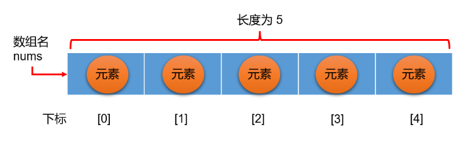
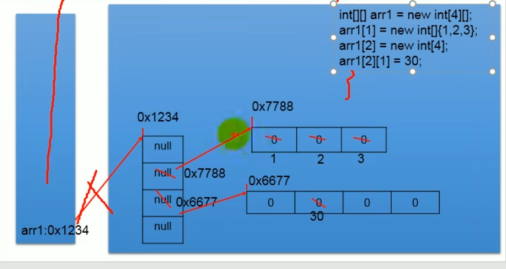

## 01.基本概念

#### 数组简介

- 多个相同类型数据按一定顺序排列的组合，使用一个名字命名，并通过编号的方式对数据进行管理

- 

  - 数组名：nums
  - 下标（索引）：[0]，[1]，[2]，[3]，[4]
  - 元素：元素1,元素2...
  - 数组长度：5

  ```java
  int[] nums=new int[5];
  nums[0]=1;
  nums[0];
  ```

#### 特点

- 数组本身是引用类型，数组中的元素可以是引用类型和基本数据类型
- 创建数组时会开辟一整块连续的内存空间，一旦初始化完成，数组长度就确定，不可更改
- 数组的元素是连续的，紧密的排列
- 数组名中引用的是内存的首地址
- 通过下标来调用数组的元素

#### 数组分类

- 按照元素类型分

  - 基本数据类型元素的数组：每个元素存储的是基本数据类型的值
  - 引用数据类型元素的数组：每个元素存储的是对象（即对象的地址）

- 按照维度分

  - 一维数组

  ```java
  int[] nums=new int[5];//一维数组
  ```

  - 二维数组

  ```
  int[][] nums=new int[5][];//二维数组
  ```

------

## 2.数组的声明和初始化

#### 一维数组的声明

- ```java
  //元素的数据类型[] 数组名称;
  int[] arr;
  double[] arr2;
  
  int arr[5];//注意，在声明时不能指定数组的长度
  ```

#### 一维数组的初始化

- 静态初始化：数组的初始化和数组元素的赋值操作同时进行

  ```java
  //一维数组的静态初始化，方式一：
  int[] arr=new int[]{1,2,3};
  
  //一维数组的静态初始化，方式二：
  int[] arr2;
  arr2=new int[]{1,2,3};
  
  //一维数组的静态初始化，方式三：
  int[] arr3={1,2,3};//注意不能分开
  ```

  - 注：数组是引用数据类型，使用new创造数组实体
  - 静态，即初始化时就明确了数组的元素

- 动态初始化：数组的初始化和数组元素的赋值操作分开进行

  ```java
  //一维数组的动态初始化，方式一：
  int[] arr=new int[5];
  
  //一维数组的动态初始化，方式二：
  int[] arr;
  arr=new int[5];
  ```

  - 动态，只确定元素的个数，不确定具体的元素值
  - 数组的长度一但确定就不可在更改

#### 一维数组的使用

- 长度：length属性

  - 即数组的元素的总数

  - 数组有length属性，就表示数组的长度

    ```java
    int[] arr=new int[5];
    arr.length;//是5
    ```

- 数组元素的使用：数组名[下标]

  - ```java
    arr[0]=1;
    arr[0];
    ```

  - 注意：下标的范围是[0,arr.length-1]

- 遍历：一层for循环

  - ```java
    for(int i=0;i<arr.length;i++){
        arr[i];
    }
    ```

#### 数组元素的默认值


- | 数组元素类型 | 默认值                                          |
  | ------------ | ----------------------------------------------- |
  | byte         | 0                                               |
  | short        | 0                                               |
  | int          | 0                                               |
  | long         | 0L                                              |
  | float        | 0.0F                                            |
  | double       | 0.0                                             |
  | char         | 0或‘\u0000’（是空字符，不可显字符），不是'0'是0 |
  | boolean      | false                                           |
  | 引用数据类型 | null                                            |

------

## 3.一维数组内存解析

- JVM的内存划分

  

  | 区域名称   | 作用                                                         |
  | :--------- | :----------------------------------------------------------- |
  | 虚拟机栈   | 用于存储正在执行的每个Java方法的局部变量表等。局部变量表存放了编译期可知长度<br/>的各种基本数据类型、对象引用，方法执行完，自动释放。 |
  | 堆内存     | 存储对象（包括数组对象），new来创建的，都存储在堆内存。      |
  | 方法区     | 存储已被虚拟机加载的类信息、常量、（静态变量）、即时编译器编译后的代码等数据。 |
  | 本地方法栈 | 当程序中调用了native的本地方法时，本地方法执行期间的内存区域 |
  | 程序计数器 | 程序计数器是CPU中的寄存器，它包含每一个线程下一条要执行的指令的地址 |

- 一维数组内存图

  ```java
  int[] arr = new int[3];
  System.out.println(arr);//[I@5f150435
  ```

  

- 数组下标为什么从0开始

  - 数组第一个元素距离数组首地址间隔0个单元格

------

## 4.多维数组

- 对应二维表格，三维以上就不推荐使用

#### 声明

- ```java
  int[][] arr;
  ```

#### 初始化

- 静态初始化：

  - ```java
    //方式一：
    int[][] arr=new int[][]{{1,2,3},{4,5}};
    
    //方式二：
    int[][] arr = {{1,2,3},{4,5,6},{7,8,9,10}};//声明与初始化必须在一句完成
    
    //方式三：
    int[][] arr;
    arr=new int[][]{{1,2,3},{4,5}};
    ```

- 动态初始化：

  - ```java
    //常见方式：
    int[][] arr=new int[5][2];
    ```

  - ```java
    //特殊方式：
    //①先确定行数：
    int[][] arr=new int[5][];//确定其行数，此时确定了5行，每一行先都是null
    
    //②在确定列数
    arr[0]=new int[5];//即定义了第一行有5个元素，第一行的五个元素都是int的默认值0，其他行还都是                                                                             null
    //③在给元素赋值
    arr[0][1]=1;
    
    //注意：
    int[][] arr=new int[][5];//只确定数组列数，是错误写法
    ```

#### 长度与角标

- 二维数组行数

  ```java
  int[][] arr=new int[5][10];
  arr.length;//输出是是5，是二维数组的长度
  ```

- 二维数组某一行的元素个数

  ```java
  //数组名[行下标].length
  arr[0].length;
  ```

- 二维数组某一个元素

  ```java
  arr[0][1];
  ```

#### 二维数组的遍历

- 双层for循环

  ```java
  for(int i=0;i<arr.length;i++){
      for(int j=0;j<arr[i].length;j++){
          arr[i][j];
      }
  }
  ```

#### 二维数组的默认初始化值

- ```java
  //情况一：
  int[][] arr=new int[3][2];
  
  arr[0]//此时输出的是内层一维数组地址值，因为内层看做是一个一维数组，
  
  arr[0][0]//输出的是数据类型的默认值
  ```

- ```java
  //情况二：
  int[][] arr=new int[5][];
  
  arr[0]//此时输出的是null，二维数组的行创建完成，但这只是个一维数组，还没确定该一维数组的个             //数，又因为数组是引用数据类型，因此是null
  
  arr[0][0];//此时报错NullPointerException，空指针异常，因为还没初始化内层数组
  ```

  

#### 二维数组内存解析

- ```java
  int[][] arr = {
      {1},
      {2,2},
      {3,3,3},
      {4,4,4,4},
      {5,5,5,5,5}
  };
  ```

- 

#### 二维数组建立内存图

- 
- 内存解析：arr1存放在栈空间中，值是二维数组的地址，new的二维数组存放在堆空间中，此时只是声明了外层的大小，由于内层是一维数组，是引用数据类型，因此外层默认值是null,在对内层元素进行赋值时，外层元素就变成了地址，内层元素默认就是 整形0 浮点0.0 了，然后在对内层元素进行修改。

------

## 5.Arrays工具类的使用

- 比较两个数组是否相等：equals()

  - equals(数组1，数组2)，返回值：boolean

  - 比较数组的长度和各个元素值是否相等

  - ```java
    int arr1[]=new int[]{1,2,3};
    int arr2[]=new int[]{1,2,3};
    
    //Arrays类中的静态方法equals()方法
    boolean equals=Arrays.equals(arr1,arr2);
    ```

- 数组元素拼接：toString()

  - toString()，返回值：String

  - 重写的toString()方法

  - ```java
    int arr1[]=new int[]{1,2,3};
    
    //Arrays类中的静态方法toString()方法
    System.out.println(Arrays.toString);//输出的是[1,2,3]
    ```

- 填充数组：fill()

  - fill(数组1，填充的数字/字符)，返回值：void

  - ```java
    int[] arr=new int[5];
    
    //Arrays类中的静态方法fill()方法
    Arrays.fill(arr1，10)；
    ```

- 数组排序：sort()

  - sort(数组1)，返回值：void

    - 使用的是快速排序，从小到大

    - ```java
      Arrays.sort(arr);//将arr数组按从小到大进行快速排序
      ```

  - sort(数组1,开始排序下标,结束排序下标)，

    - 把数组1的从开始下标到结束下标的部分快速排序

    - ```java
      Arrays.sort(arr,0,5);//将arr数组的第1个元素到底6个元素部分按从小到大进行快速排序
      ```

- 数组的二分查找：binarySearch()

  - binarySearch(数组1,查找的值)

------

## 6.常见的数组异常

#### 数组角标越界异常

- ArrayindexOutOfBoundsException

#### 空指针异常

- NullPointerException
- 此时数组的一行还未分配空间，即是null

