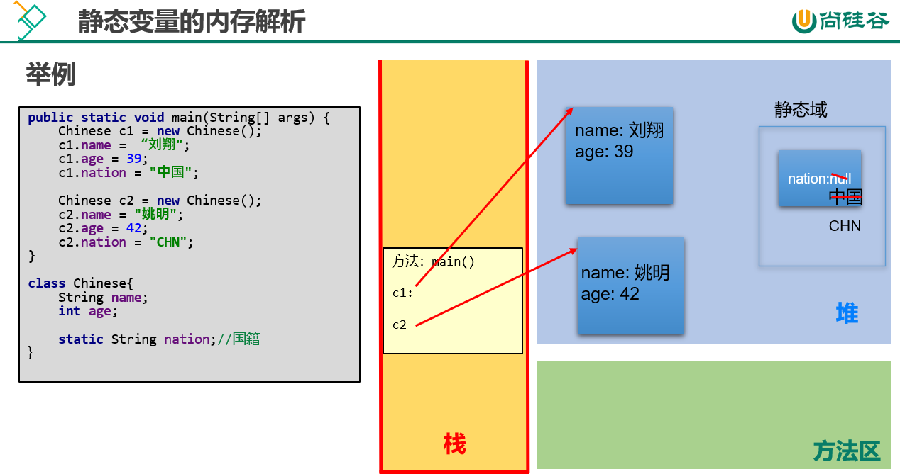

## 1.static关键字

#### 概念

- 被static修饰的成员被类的所有实例所共享
- 可修饰的结构
  - 属性（被修饰后叫静态变量，类变量）
  - 方法（被修饰后叫静态方法，类方法）
  - 代码块
  - 内部类
- 被修饰结构的特点
  - 随着类的加载而加载，因此优先于对象存在
  - 修饰的成员被所有的对象共享
  - 可不创建对象，直接使用类名来调用被修饰结构

#### 格式

- ```java
  class Person{
      private static int age;//静态变量
      public static void eat(){//静态方法
          //代码
      }
  }
  ```

#### 静态变量

- 特点

  - 默认值不变，被所有的类对象所共享
  - 可以在任意的类成员中被使用
  - 可直接使用类名来进行访问，也可使用类对象来进行访问
  - 静态变量的get/set方法是静态的
  - 当局部变量和静态变量重名时，使用类名.静态变量来区分

- 举例

  ```java
  class Chinese{
      //实例变量
      String name;
      int age;
      
      //静态变量
      static Stirng nation;//国籍
  }
  
  main(){
      Chinese c1 = new Chinese("康师傅",36);
          c1.nation = "中华人民共和国";
          Chinese c2 = new Chinese("老干妈",66);
          System.out.println(c1);//nation = "中华人民共和国";
          System.out.println(c2);//nation = "中华人民共和国";
  }
  ```

- 内存结构：静态变量在jdk7后，放在了内存的堆空间的静态域中中

  

#### 静态方法

- 特点

  - 在静态方法内部只能调用静态属性和静态方法，不能访问非静态的结构。因为非静态的结构属于类的对象，只有创建对象时非静态结构在会被创建，而静态结构是跟随着类的，因此不能调用非静态结构

  - 静态方法可在其他类的成员中被调用
  - 可使用类名.静态方法名和对象名.静态方法名来进行调用

- 举例

  ```java
  class Person{
      int age;
      static string nation;//静态属性
      
      //静态方法
      public static vodi eat(){
          age=12;//错误，静态方法不能调用非静态结构
          nation="中";//正确，静态方法只能调用静态结构
      }
  }
  
  main(){
      Perosn.eat()//直接通过类来调用静态方法
      Person p1=new Person();
      p1.eat();//通过对象来调用静态方法
      
  }
  ```

------

## 2.static的应用：单例设计模式（已补充线程）

#### 概念

- 某个类只能有一个对象，并且该类只提供一个取得其对象实例的方法，就叫单例模式

#### 饿汉式（无线程安全问题）

- 在类的内部直接就造好对象，在main方法中直接调用得到对象的方法即可

- ```java
  class Bank{
      //1.私有化类的构造器，这样外部就不能造对象了
      private Bank(){}
      
      //2.在类的内部创建对象，必须是私有静态的，这样外部就不能调用
      private static Bank instance =new Bank();
      
      //3.提供得到类对象的方法
      public static Bank getInstance(){return instance;};
  }
  
  main(){
      //4.得到对象
      Bank.getInstance();
  }
  ```

- 特点

  - 立即加载，在加载完类后就已将对象创建完毕

- 优点

  - 实施简单，没有线程安全问题

- 缺点

  - 当类加载完成后，该对象实例会一直占用内存，直到类被卸载，该对象消失

#### 懒汉式（存在线程安全问题）

- 先造对象为null，在获取对象方法中写上if语句，如果已经造过对象就直接返回对象，没造过对象就new

- ```java
  class Bank{
      //1.私有化类的构造器，这样外部就不能造对象了
      private Bank(){}
      
      //2.在类的内部创建对象为null，必须是私有静态的，这样外部就不能调用
      private static Bank instance =null;
      
      //3.提供得到类对象的方法
      //线程安全：解决方式一：使用synchronized修饰返回对象的方法
      public static synchronized Bank getInstance(){
          if(instance==null){//如果该对象还没创建，就new
              //线程安全：解决方式二：使用同步监视器
              synchronized(Bank.class){
              instance=new Bank();
                  }
          }else{
          return instance;//如果创建了就直接返回对象
              }
      };
  }
  
  main(){
      //4.得到对象
      Bank.getInstance();
  }
  ```

- 特点

  - 延迟加载，在调用静态方法时才被创建
- 优点

  - 延迟加载，节约内存
- 缺点

  - 存在线程安全问题

#### 单例模式的优点

- 类只有一个对象，减少系统性能开销

#### 应用场景

- 数据库连接池的设计：因为数据库连接是一种数据库资源

- 应用程序的日志：由于共享的日志文件一直处于打开状态，因为只

  能有一个实例去操作，否则内容不好追加

- Windows的Task Manager (任务管理器)就是很典型的单例模式

------

## 3.main方法

由于JVM需要调用类的main()方法，所以该方法的访问权限必须是public，又因为JVM在执行main()方法时不必创建对象，所以该方法必须是static的，该方法接收一个String类型的数组参数，该数组中保存执行Java命令时传递给所运行的类的参数。 

又因为main() 方法是静态的，我们不能直接访问该类中的非静态成员，必须创建该类的一个实例对象后，才能通过这个对象去访问类中的非静态成员

------

## 4.代码块

#### 概念

- 如果成员变量是需要通过复杂的计算或读取文件、或读取运行环境信息等方式才能获取的一些值，可使用代码块
- 作用
  - 对类或对象进行初始化
- 分类
  - 静态代码块
  - 非静态代码块

#### 格式

- ```java
  class Person{
      //属性
      int age;
      String name;
      //构造器
      Person(){
          
      }
      //非静态代码块
      {
          sout;
      } 
      //静态代码块
      static{
          sout;
      }
  }
  ```

#### 特点

- 可以有输出语句

- 代码块执行（注意代码块是执行而不是加载）的顺序是从上到下，且先于构造器执行

- 非静态代码块

  - 对对象的属性等信息进行初始化
  - 非静态代码块在每次创建对象时都会执行，且先于非静态构造器执行

  - 非静态代码块可调用静态和非静态
  - 对于非静态代码块：如果多个重载的构造器有公共代码，并且这些代码都是先于构造器其他代码执行的，那么可以将这部分代码抽取到非静态代码块中，减少冗余代码

- 静态代码块

  - 对类的信息进行初始化
  - 静态代码块在加载类时会执行，且先于静态构造器执行
  - 静态代码块只能调用静态结构

------

## 5.实例变量赋值顺序

#### 赋值

- 成员变量的默认初始化值
- 显示赋值，代码块赋值（这两个都是在默认值后，构造器之前，根据代码顺序来执行）
- 构造器赋值
- 对象.属性，类.属性进行赋值

#### 开发中变量赋值位置的选择

- 显示赋值：适合每个对象的属性值都相同
- 构造器赋值：适合每个对象的属性值都不同
- 静态代码块：常用于给静态变量赋值

------

## 6.final关键字

#### 概念

- final：不可变的，最终的
- 可修饰类：表示这个类不能被继承，无子类
- 可修饰方法：表示这个方法不能被子类重写
- 可修饰属性（局部变量和成员变量都可）：表示属性是一个常量，不可被更改，且在使用前一定要进行赋值
  - 可显示赋值
  - 在代码块中赋值
  - 在构造器中赋值

------

## 7.abstract关键字

#### 概念

- abstract：抽象的
- 被abstract修饰的类叫抽象类
  - 抽象类不能够造对象
  - 有构造器，作用：供子类来造对象，初始化父类的成员变量
  - 抽象类不一定包含抽象方法，但包含抽象方法的类一定是抽象类
  - 子类在继承抽象类后，必须重写父类的全部抽象方法，否则，子类也是一个抽象类
- 被abstract修饰的方法叫抽象方法
  - 抽象方法不能有方法体，不能有{}
- 注意：abstract不可修饰（语言的自洽性）
  - 变量，代码块，构造器
  - 不可修饰私有方法，静态方法，final方法，final类

#### 格式

- ```java
  //抽象类
  abstract class Person{
      //抽象方法：注意抽象方法没有 { }
      public abstract void eat(形参列表);
  }
  ```

------

## 8.接口

#### 概念

- 类是is-a的概念，而接口是have-a的概念，即一个类是否有某种功能
- 关键字：interfance
- 理解接口是一种规范
- 注意接口和类是两种并行的引用数据类型，二者没啥太大关系
- 接口中没有构造器和代码块，因为接口中没有属性需要动态初始化

- 接口的规则变化
  - 在JDK8.0之前只能有
    - 公共的静态常量：public static final
    - 公共的抽象方法：public abstract
  - 在JDK8.0时可以有
    - 公共的默认方法：public default
    - 公共的静态方法：public static
  - 在JDK9.0可以有
    - 私有方法

#### 使用规则

- 接口不能造对象，但是可以通过接口名直接调用静态方法和常量

- 接口和接口之间是继承关系（extends）

  - 接口和接口之间可以是多重继承，注意类和类是单继承
  - 子接口继承父接口的方法，方法名相同的抽象方法只需实现一次

- 类实现接口（implements），一个类可实现多个接口，多实现

  - 接口的实现类如果不是非抽象类。就要实现接口的全部抽象方法（抽象方法的规则）
  - 接口的静态方法（JDK8.0中新加的）不能被继承，也不能被重写，且只能用接口名.方法名()的方式来调用，不能用实现类对象来调用

- 接口与实现类对象构成多态的引用

  - ```java
    接口名 变量名=new 实现类名();
    //父类名 变量名=new 子类名();
    ```

- 类优先原则

  - 如果类A和接口B都声明了相同的方法method1()，类C继承了类A实现了接口B
    - 如果类C重写了method1，就不会调用类A和接口B的method1
    - 没重写就调用类A的method1,因为类比接口高级

#### 格式

- ```java
  //interface关键字定义接口
  interface eat{
      //公共的静态常量：public static final（可省略）
      int a=0;//就等于是public static fianl int a=0
      
      //公共的抽象方法：public abstract（可省略）
      void a();//就等于是public abstract void a();
  }
  
  
  interface fly {
      
  }
  
  //接口和接口之间能够实现继承关系，且是多继承关系
  interface run extends eat,fly{}
  
  //类和接口之间能够实现多重实现，实现多个接口
  class Person implements eat,fly{}
  ```

#### 匿名写法

- ```java
  //USB接口的定义
  public interface USB {
  //    接口的属性都是静态常量
      int a=10;
      int b=20;
  //    接口的方法都是抽象方法
      void star();
      void stop();
  
  }
  ```

- ```java
  //照相机类的定义，实现USB接口
  public class Camera  implements USB{
  
      @Override
      public void star() {
          System.out.println("照相机结束工作");
      }
  
      @Override
      public void stop() {
          System.out.println("照相机开始工作");
      }
  }
  ```

- ```java
  //打印机类的定义，实现USB接口
  public class Printer implements USB {
  
      @Override
      public void star() {
          System.out.println("打印机开始工作");
      }
  
      @Override
      public void stop() {
          System.out.println("打印机结束工作");
      }
  }
  
  ```

- ```java
  //电脑类的定义
  public class Computer {
  //    接口作为形参，可以使用其属性与方法
      public void transferData(USB usb){
          System.out.println("传输开始");
          usb.star();
          System.out.println("传输中");
          usb.stop();
          System.out.println("传输结束");
  
      }
  }
  ```

- ```java
  //main方法  
       Computer computer=new Computer();
          Printer printer =new Printer();
  
  //       1. 创建接口实现类对象
  //        这就是接口多态的应用
  //        transferData()形参是USB接口，传递过来的是接口的实现类，跟类的多态一样
          computer.transferData(printer);
  
  //        2.创建接口实现类的匿名对象
  //        匿名对象的使用
          computer.transferData(new Camera());
  
  //      3.  创建接口匿名实现类的对象
  //     在new后面重写了抽象方法
  //        USB()本应该是实现类（类似子类），如Printer类，Camera类，但是没有，直接重写方法
  //        这是新建了接口的实现类对象，不是接口的对象，接口不能键对象
          USB usb1=new USB() {
              @Override
              public void star() {}
              @Override
              public void stop() {}
          };
          computer.transferData(usb1);
  
  //        4.创建接口匿名时间类的匿名对象
  //        结合了3和2
          computer.transferData(new USB() {
              @Override
              public void star() {
  
              }
  
              @Override
              public void stop() {
  
              }
          });
  
  ```

------

## 9.内部类

#### 概念

- 将一个类A定义在另一个类B里面，里面的那个类A就称为`内部类（InnerClass）`，类B则称为`外部类（OuterClass）`。

- 为什么需要内部类

  - 具体来说，当一个事物A的内部，还有一个部分需要一个完整的结构B进行描述，而这个内部的完整的结构B又只为外部事物A提供服务，不在其他地方单独使用，那么整个内部的完整结构B最好使用内部类。

    总的来说，遵循`高内聚、低耦合`的面向对象开发原则。

#### 分类

- 成员内部类（跟随着外部类，和属性，方法是并列的）
  - 静态成员内部类
  - 非静态成员内部类
- 局部内部类（在方法，代码块中定义的，跟随着方法，代码块）
  - 非匿名局部内部类
  - 匿名局部内部类

#### 成员内部类

- 概述
  - 如果成员内部类中不使用外部类的非静态成员，那么通常将内部类声明为静态内部类，否则声明为非静态内部类。
- 成员内部类的使用特征，概括来讲有如下两种角色
  - 成员内部类作为`类的成员的角色`：
    - 和外部类不同，Inner class还可以声明为private或protected；
    - 可以调用外部类的结构。（注意：在静态内部类中不能使用外部类的非静态成员）
    - Inner class 可以声明为static的，但此时就不能再使用外层类的非static的成员变量；
  - 成员内部类作为`类的角色`：
    - 可以在内部定义属性、方法、构造器等结构
    - 可以继承自己的想要继承的父类，实现自己想要实现的父接口们，和外部类的父类和父接口无关
    - 可以声明为abstract类 ，因此可以被其它的内部类继承
    - 可以声明为final的，表示不能被继承
    - 编译以后生成OuterClass$InnerClass.class字节码文件（也适用于局部内部类）
  - 注意
    - 外部类访问成员内部类的成员，需要“内部类.成员”或“内部类对象.成员”的方式
    - 成员内部类可以直接使用外部类的所有成员，包括私有的数据
    - 当想要在外部类的静态成员部分使用内部类时，可以考虑内部类声明为静态的

- ```java
  public class TestMemberInnerClass {
      public static void main(String[] args) {
          //创建静态内部类实例，并调用方法
          Outer.StaticInner inner = new Outer.StaticInner();
          inner.inFun();
          //调用静态内部类静态方法
          Outer.StaticInner.inMethod();
  
          System.out.println("*****************************");
          
          //创建非静态内部类实例（方式1），并调用方法
          Outer outer = new Outer();
          Outer.NoStaticInner inner1 = outer.new NoStaticInner();
          inner1.inFun();
  
          //创建非静态内部类实例（方式2）
          Outer.NoStaticInner inner2 = outer.getNoStaticInner();
          inner1.inFun();
      }
  }
  class Outer{
      private static String a = "外部类的静态a";
      private static String b  = "外部类的静态b";
      private String c = "外部类对象的非静态c";
      private String d = "外部类对象的非静态d";
  
      static class StaticInner{
          private static String a ="静态内部类的静态a";
          private String c = "静态内部类对象的非静态c";
          public static void inMethod(){
              System.out.println("Inner.a = " + a);
              System.out.println("Outer.a = " + Outer.a);
              System.out.println("b = " + b);
          }
          public void inFun(){
              System.out.println("Inner.inFun");
              System.out.println("Outer.a = " + Outer.a);
              System.out.println("Inner.a = " + a);
              System.out.println("b = " + b);
              System.out.println("c = " + c);
  //            System.out.println("d = " + d);//不能访问外部类的非静态成员
          }
      }
  
      class NoStaticInner{
          private String a = "非静态内部类对象的非静态a";
          private String c = "非静态内部类对象的非静态c";
  
          public void inFun(){
              System.out.println("NoStaticInner.inFun");
              System.out.println("Outer.a = " + Outer.a);
              System.out.println("a = " + a);
              System.out.println("b = " + b);
              System.out.println("Outer.c = " + Outer.this.c);
              System.out.println("c = " + c);
              System.out.println("d = " + d);
          }
      }
  
  
      public NoStaticInner getNoStaticInner(){
          return new NoStaticInner();
      }
  }
  ```

#### 非匿名局部内部类

- 编译后有自己的独立的字节码文件，只不过在内部类名前面冠以外部类名、$符号、编号。
  - 这里有编号是因为同一个外部类中，不同的方法中存在相同名称的局部内部类

- 和成员内部类不同的是，它前面不能有权限修饰符等

- 局部内部类如同局部变量一样，有作用域

- 局部内部类中是否能访问外部类的非静态的成员，取决于所在的方法

- ```java
  public class TestLocalInner {
      public static void main(String[] args) {
          Outer.outMethod();
          System.out.println("-------------------");
  
          Outer out = new Outer();
          out.outTest();
          System.out.println("-------------------");
  
          Runner runner = Outer.getRunner();
          runner.run();
  
      }
  }
  class Outer{
  
      public static void outMethod(){
          System.out.println("Outer.outMethod");
          final String c = "局部变量c";
          class Inner{
              public void inMethod(){
                  System.out.println("Inner.inMethod");
                  System.out.println(c);
              }
          }
  
          Inner in = new Inner();
          in.inMethod();
      }
  
      public void outTest(){
          class Inner{
              public void inMethod1(){
                  System.out.println("Inner.inMethod1");
              }
          }
  
          Inner in = new Inner();
          in.inMethod1();
      }
  
      public static Runner getRunner(){
          class LocalRunner implements Runner{
              @Override
              public void run() {
                  System.out.println("LocalRunner.run");
              }
          }
          return new LocalRunner();
      }
  
  }
  interface Runner{
      void run();
  }
  ```

#### 匿名内部类

- 因为考虑到这个子类或实现类是一次性的，那么我们“费尽心机”的给它取名字，就显得多余。那么我们完全可以使用匿名内部类的方式来实现，避免给类命名的问题

- 使用匿名内部类的对象直接调用方法：

  ```java
  interface A{
  	void a();
  }
  public class Test{
      public static void main(String[] args){
      	new A(){
  			@Override
  			public void a() {
  				System.out.println("aaaa");
  			}
      	}.a();
      }
  }
  ```

- 通过父类或父接口的变量多态引用匿名内部类的对象

  ```java
  interface A{
  	void a();
  }
  public class Test{
      public static void main(String[] args){
      	A obj = new A(){
  			@Override
  			public void a() {
  				System.out.println("aaaa");
  			}
      	};
      	obj.a();
      }
  }
  ```

- 匿名内部类的对象作为实参

  ```java
  interface A{
  	void method();
  }
  public class Test{
      public static void test(A a){
      	a.method();
      }
      
      public static void main(String[] args){
      	test(new A(){
  
  			@Override
  			public void method() {
  				System.out.println("aaaa");
  			}
      	});
      }   
  }
  ```

#### 匿名情况

- ```java
      public static void main(String[] args) {
  //        1.提供接口的匿名实现类的对象
          A a1=new A(){
              public void method(){
  
              }
          };
          a1.method();
  
  //        2.提供接口的匿名实现类的匿名对象
          new A(){
              public void method(){
  
              }
          }.method();
  
  //        3.继承于抽象类的匿名子类的对象
          B b=new B(){
              public  void method1(){
  
              }
          };
          b.method1();
          System.out.println(b.getClass());//结果是OuterClassTest2
  //         4.继承于抽象类的匿名子类的匿名对象
          new B(){
              public  void method1(){
  
              }
          }.method1();
  //        5.提供了一个继承于C的匿名子类的对象
          C c1=new C(){};
          c1.method2();
          System.out.println(c1.getClass());
  //        6.提供了一个继承于C的匿名子类的对象
          C c2=new C(){
              public void method2(){
                  System.out.println("111");
              }
          };
          System.out.println("c2的所属类是"+c2.getClass());
  //        7.提供了一个继承于C的匿名子类的匿名对象
          new C(){
              public void method2(){
                  System.out.println("111");
              }
          }.method2();
  
      }
  
  }
  
  interface A{
      public void method();
  }
  
  class SubA implements  A{
  
      @Override
      public void method() {
  
      }
  }
  abstract class B{
      public abstract void method1();
  }
  
  class SubB extends B{
  
      @Override
      public void method1() {
  
      }
  }
  
  class C{
      public void method2(){
          System.out.println("C:method2");
  }
  
  ```

------

## 10.枚举类

#### 概念

- 枚举类是一种特殊的类，该类的对象是已经确定的，有限个的
- 关键字：enum
- 在开发中
  - 如果一个类的实例是确定的有限个，可以声明为枚举类
  - 如果实例只有一个，可以考虑单例模式

#### Enum关键字

- 使用enum来定义枚举类，默认继承父类Enum，因此不能在继承其他类
  - Object-->Enum-->枚举类
- 枚举类的常量对象列表必须在枚举类的首行，因为是常量，所以建议大写
- Enum省略的东西
  - 实例省略了public static final 和new
  - 编译器给枚举类默认提供的是private的无参构造，如果枚举类需要的是无参构造，就不需要声明
  - 如果枚举类需要的是有参构造，需要手动定义，有参构造的private可以省略

#### 枚举类中的方法

- 这些方法直接使用 枚举类名.方法() 来直接调用即可

- toString()
- name()
  - 返回值：String
  - 得到当前枚举类对象的名称
- values()
  - 返回值：枚举类数组
  - 将所有枚举类的对象放入数组中
- valuesOf()
  - 返回值：枚举类对象
  - 返回枚举类中名称为xxx的对象，新建枚举类类对象来接收，即指向同一块内存
  - 不存在名为xxx的枚举类对象则报错：IllegalArgumentException
- ordinal()
  - 返回值：int
  - 返回枚举类对象在声明时的次序，从0开始

#### 格式

- ```java
  //普通类定义枚举类
  //JDK5.0之前定义枚举类
  public class Season {
  //    属性声明
  private final String seasonName;//季节名称
  private final String desc;//描述
  
  //1.私有化类的构造器
      private Season(String seasonName,String desc){
          this.seasonName=seasonName;
          this.desc=desc;
      }
  //    2.get()方法
  
      public String getSeasonName() {
          return seasonName;
      }
  
      public String getDesc() {
          return desc;
      }
  //    3.在类的内部创建对象
  //    创建枚举类对象
      public  static Season spring=new Season("春","春天");
      public  static  Season summer=new Season("夏","夏天");
      public  static Season autumn=new Season("秋","秋天");
      public  static   Season winter=new Season("冬","冬天");
  
  
  }
  ```

  

- ```java
  //使用enum关键字定义
  public enum Season{
    //1.先创建枚举类的对象，注意对象之间用,  最后结束用;
      //这里其实省略的是public static final 和new
      SPRING(属性的赋值),
      SUMMER(属性的赋值),
      AUTUMN(属性的赋值),
      WINTER(属性的赋值);
      
      //2.声明属性，和定义类一样
      private final String seasonName;//季节名称
      private final String desc;//季节名称
      
      //3.声明构造器，和定义类一样
      //注意构造器是私有的，防止外部造对象
      private Season(String seasonName,String desc){
      this.seasonName=seasonName;
      this.desc=desc;
  }
      
      //4.定义get/set方法，toString()方法
      ...
  }
  
  //main()方法
  main(){
      //直接使用枚举类名来调用枚举类队象
      System.out.println(Season.SPRING);//直接调用toString()方法
      
      //枚举类的name()方法
      System.out.println(Season.SPRING.name());//输出的是SPRING
      
      //枚举类的values()方法
      Season[] values = Season.values();//将所有枚举类的对象放入数组中
      
      //枚举类的valuesOf()方法
       String spring="SPRING";
          Season season=Season.valueOf(spring);
          System.out.println(season.getSeasonName());//SPRING
      
      //枚举类的ordinal()方法
      System.out.println(Season.SPRING.ordinal());//0
  }
  ```

#### 实现接口的枚举类

- 枚举类可以实现一个或多个接口
- 若每个枚举类对象在调用实现的接口方法呈现相同的行为方式，则只要统一实现该方法即可
- 若需要每个枚举类对象在调用实现的接口方法呈现出不同的行为方式，则可以让每个枚举值分别来实现该方法

- ```java
  //Info接口的定义
  public interface Info {
      void show();//抽象方法show()
  }
  ```

  ```java
  public enum Season implements Info {
      //如果每一个枚举类的show方法都不一样，每个对象单独实现即可
      //    1.先创建枚举类的对象
      SPRING("春","春天"){
  //        枚举类中每一个对象都重写接口中的抽象方法
          @Override
          public void show() {
              System.out.println("春春天");
          }
      },
      SUMMER("夏","夏天") {
          //        枚举类中每一个对象都重写接口中的抽象方法
          @Override
          public void show() {
              System.out.println("夏夏天");
          }
      },
      AUTUMN("秋","秋天") {
          //        枚举类中每一个对象都重写接口中的抽象方法
          @Override
          public void show() {
              System.out.println("秋秋天");
          }
      },
      WINTER("冬","冬天") {
          //        枚举类中每一个对象都重写接口中的抽象方法
          @Override
          public void show() {
              System.out.println("冬冬天");
          }
      };
  
  
      //    定义类一样，声明属性
      private final String seasonName;//季节名称
      private final String desc;//描述
      //    定义类一样，声明构造器
      private Season(String seasonName,String desc){
          this.seasonName=seasonName;
          this.desc=desc;
      }
  
  //定义类一样，get()方法
      public String getSeasonName() {
          return seasonName;
      }
  
      public String getDesc() {
          return desc;
      }
      //定义类一样，重写toString()方法
      @Override
      public String toString() {
          return "Package_12.Season{" +
                  "seasonName='" + seasonName + '\'' +
                  ", desc='" + desc + '\'' +
                  '}';
      }
      
  //如果每个枚举类对象的show方法都一样，直接统一实现接口的抽象方法即可
      @Override
      public void show() {
          System.out.println("111");
      }
  
  }
  ```

------

## 11.注解

#### 概念

- 关键字：Annotation

- 注解（Annotation）是从`JDK5.0`开始引入，以“`@注解名`”在代码中存在

- Annotation 可以像修饰符一样被使用，可用于修饰包、类、构造器、方法、成员变量、参数、局部变量的声明。还可以添加一些参数值，这些信息被保存在 Annotation 的 “name=value” 对中。

  注解可以在类编译、运行时进行加载，体现不同的功能。

#### 注释与注解

- 注解也可以看做是一种注释，通过使用 Annotation，程序员可以在不改变原有逻辑的情况下，在源文件中嵌入一些补充信息。但是，注解，不同于单行注释和多行注释。
  - 对于单行注释和多行注释是给程序员看的。
  - 而注解是可以被编译器或其他程序读取的。程序还可以根据注解的不同，做出相应的处理。

#### 注解的重要性

- 在JavaSE中，注解的使用目的比较简单，例如标记过时的功能，忽略警告等。在`JavaEE/Android中注解占据了更重要的角色`，例如用来配置应用程序的任何切面，代替JavaEE旧版中所遗留的`繁冗代码`和`XML配置`等。

  未来的开发模式都是基于注解的，JPA是基于注解的，Spring2.5以上都是基于注解的，Hibernate3.x以后也是基于注解的，Struts2有一部分也是基于注解的了。`注解是一种趋势`，一定程度上可以说：`框架 = 注解 + 反射 + 设计模式`。

#### 常见的注解

- 生成文档相关的注解

  ```java
  @author 标明开发该类模块的作者，多个作者之间使用,分割
  @version 标明该类模块的版本
  @see 参考转向，也就是相关主题
  @since 从哪个版本开始增加的
  @param 对方法中某参数的说明，如果没有参数就不能写
  @return 对方法返回值的说明，如果方法的返回值类型是void就不能写
  @exception 对方法可能抛出的异常进行说明 ，如果方法没有用throws显式抛出的异常就不能写
  ```

- 在编译时进行格式检查(JDK内置的三个基本注解)

  - @Override: 限定重写父类方法，该注解只能用于方法
  - @Deprecated: 用于表示所修饰的元素(类，方法等)已过时。通常是因为所修饰的结构危险或存在更好的选择
  - @SuppressWarnings: 抑制编译器警告

- 跟踪代码依赖性，实现替代配置文件功能

  - Servlet3.0提供了注解(annotation)，使得不再需要在web.xml文件中进行Servlet的部署。

#### 三个基本的注解

- @Override

  - 用于检测被标记的方法为有效的重写方法，如果不是，则报编译错误！

  - 只能标记在方法上。

  - 它会被编译器程序读取。

- @Deprecated

  - 用于表示被标记的数据已经过时，不推荐使用。

  - 可以用于修饰 属性、方法、构造、类、包、局部变量、参数。

  - 它会被编译器程序读取。

- @SuppressWarnings

  - 抑制编译警告。当我们不希望看到警告信息的时候，可以使用 SuppressWarnings 注解来抑制警告信息

  - 可以用于修饰类、属性、方法、构造、局部变量、参数

  - 它会被编译器程序读取。
  - 可以指定的警告类型有

#### 元注解

- JDK1.5在java.lang.annotation包定义了4个标准的meta-annotation类型，它们被用来提供对其它 annotation类型作说明。

  （1）**@Target：**用于描述注解的使用范围

  - 可以通过枚举类型ElementType的10个常量对象来指定
  - TYPE，METHOD，CONSTRUCTOR，PACKAGE.....

  （2）**@Retention：**用于描述注解的生命周期

  - 可以通过枚举类型RetentionPolicy的3个常量对象来指定
  - SOURCE（源代码）、CLASS（字节码）、RUNTIME（运行时）
  - `唯有RUNTIME阶段才能被反射读取到`。

  （3）**@Documented**：表明这个注解应该被 javadoc工具记录。

  （4）**@Inherited：**允许子类继承父类中的注解

#### 自定义注解（了解）

- 一个完整的注解应该包含三个部分

  - 声明
  - 使用
  - 读取

- ```java
  【元注解】
  【修饰符】 @interface 注解名{
      【成员列表】
  }
  ```

- 自定义注解可以通过四个元注解@Retention,@Target，@Inherited,@Documented，分别说明它的声明周期，使用位置，是否被继承，是否被生成到API文档中。

- Annotation 的成员在 Annotation 定义中以无参数有返回值的抽象方法的形式来声明，我们又称为配置参数。返回值类型只能是八种基本数据类型、String类型、Class类型、enum类型、Annotation类型、以上所有类型的数组

- 可以使用 default 关键字为抽象方法指定默认返回值

- 如果定义的注解含有抽象方法，那么使用时必须指定返回值，除非它有默认值。格式是“方法名 = 返回值”，如果只有一个抽象方法需要赋值，且方法名为value，可以省略“value=”，所以如果注解只有一个抽象方法成员，建议使用方法名value。

- ```java
  //自定义注解
  public @interface MyAnnotation {
      String[] value() default "hello";
  }
  ```

------

## 12.包装类

#### 概念

- 基本数据类型定义的类就是包装类，把基本数据类型给包装了一下，就成了包装类，使得基本数据类型有了类的特点

#### 分类


- | 基本数据类型 | 包装类    |
  | ------------ | --------- |
  | byte         | Byte      |
  | short        | Short     |
  | int          | Integer   |
  | long         | Long      |
  | float        | Float     |
  | double       | Double    |
  | char         | Character |
  | boolean      | Boolean   |

  - 其中Byte，Short，Integer，Long，Float，Double类都是以Number为父类

#### 包装类与基本数据类型之间的转换

- 自动装箱与拆箱（语法糖，简化代码）

- ```java
  //自动装箱：基本数据类型转换成包装类
  Integer i=4;//自动装箱，相当于Integer i =Integet.valueOf(4);
  
  //自动拆箱：包装类转换成基本数据类型
  int num=i;
  ```

- 使用包装类的方法

  - 装箱：基本数据类型转换成包装类

    - 方法一：使用包装类的构造器，穿入基本数据类型

      ```java
       int i1=10;
       Integer integer1=new Integer(i1);
      ```

    - 方法二：使用包装类的valueOf()方法

      ```java
      int i2=10;
      Integer integer2=Integer.valueOf(i2);
      ```

  - 拆箱：包装类转换成基本数据类型

    - 使用包装类的xxxvalue()方法，赋值给对应的基本数据类型

      ```java
      Integer integer3=Integer.valueOf(10);
      int i3= integer3.intValue();
      ```

#### 基本数据类型、包装类与字符串间的转换

- 基本数据类型转化为String类

  - 调用String类中的各种重载的静态的valueOf()方法

    ```java
    int i1 = 10;
    String s1 = String.valueOf(i1);
    ```

- String类转换成基本数据类型

  - String类没法直接转换成基本数据类型，因为数据类型中没有方法

  - 只能是String类->包装类->基本数据类型

    - 先使用包装类中的静态方法parseXxx()方法，转换成包装类

    - ```java
      String s1="10";
      Integer integer1=Integer.parseInt(s1);
      ```

    - 在使用自动拆箱，转换成基本数据类型

    - ```java
      int i2=integer1;
      ```

------

