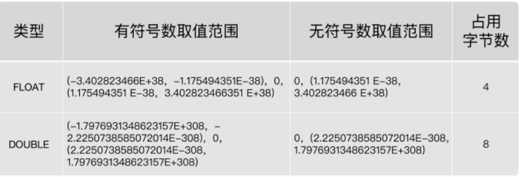

## 1.整数类型

#### 字符集问题

- 可以设置字符集的地方

  - 创建数据库时
  - 创建表时
  - 创建字段时

- 格式：

  ```mysql
  CHARACTER SET 'utf8'
  ```

- 如果不明确的指出在创建数据库，表，字段时的字符集

  - 创建数据库时按照mysql配置文件my.ini来指定字符集
  - 创建表时跟随数据库的字符集
  - 创建字段时跟随表的字符集

- 推荐在创建数据库时设置字符集，之后就不用设置

#### 整数类型的分类


- | 整数类型    | 字节 | 有符号数取值范围                         | 无符号数取值范围       |
  | ----------- | ---- | ---------------------------------------- | ---------------------- |
  | TINYINT     | 1    | -128~127                                 | 0~255                  |
  | SAMLLINT    | 2    | -32768~32767                             | 0~65535                |
  | MEDIUMINT   | 3    | -8388608~8388607                         | 0~16777215             |
  | INT,INTEGER | 4    | -2147483648~2147483647                   | 0~4294967295           |
  | BIGINT      | 8    | -9223372036854775808~9223372036854775807 | 0~18446744073709551615 |

- 当在插入数据时，超出了数据类型的范围，会报错误信息

  - Out of range value for column 'f1' at row 1

- 当使用MYSQL5.7时，查看表的结构时，对于INT类型会显示数据的宽度

  - tinyint(4)
  - TINYINT有符号数和无符号数的取值范围分别为-128~127和0~255，由于负号占了一个数字位，因此TINYINT默认的显示宽度为4。同理，其他整数类型的默认显示宽度与其有符号数的最小值的宽度相同。

#### 可选属性

- M（已不推荐使用）

  - ```mysql
    #举例：使用M和ZEROFILL
    #如：INT(5)，5就是M
    CREATE TABLE test_int2(
    	f1 INT,
    	f2 INT(5),
    	f3 INT(5) ZEROFILL#显示宽度为5，不足时用0填充，超过5位无所谓
    );
    ```

    

  - 当数据宽度小于5位的时候在数字前面需要用0填满宽度，该项功能需要配合“ ZEROFILL ”使用，才表示用“0”填满宽度，否则指定显示宽度无效。

  - 超过宽度5，无所谓，正常显示

- ZEROFILL（已不推荐使用）

  - 用0填充，搭配M使用，在使用ZEROFILL时，会自动使用UNSIGNED

  - ```mysql
    #举例：使用M和ZEROFILL
    CREATE TABLE test_int2(
    	f1 INT,
    	f2 INT(5),
    	f3 INT(5) ZEROFILL#显示宽度为5，不足时用0填充，超过5位无所谓
    );
    
    INSERT INTO test_int2(f3)
    VALUES(123),(123465);
    
    SELECT * FROM test_int2;
    #此时f3字段的123会使00123，而1234565依旧不变
    ```

- UNSIGNED

  - 使用无符号范围（即0~范围，只取正数）

  - ```mysql
    #举例：使用UNSIGNED
    CREATE TABLE test_int3(
    	f1 INT UNSIGNED#此时f1的取值范围变成了0~4294967295
    );
    ```

- 总结：在8.0中，不推荐使用int类型的M和ZEROFILl属性

#### 使用场景


- | 类型         | 适用场景                                                     |
  | ------------ | ------------------------------------------------------------ |
  | TINYINT      | 一般用于枚举数据，比如系统设定取值范围很小且固定的场景。     |
  | SMALLINT     | 可以用于较小范围的统计数据，比如统计工厂的固定资产库存数量等。 |
  | MEDIUMINT    | 用于较大整数的计算，比如车站每日的客流量等。                 |
  | INT、INTEGER | 取值范围足够大，一般情况下不用考虑超限问题，用得最多。比如商品编号。 |
  | BIGINT       | 只有当你处理特别巨大的整数时才会用到。比如双十一的交易量、大型门户网站点击量、证券公司衍生产品持仓等。 |

- 如何选择？

  - 在评估用哪种整数类型的时候，你需要考虑 存储空间 和 可靠性 的平衡问题：一方 面，用占用字节数少的整数类型可以节省存储空间；另一方面，要是为了节省存储空间， 使用的整数类型取值范围太小，一
    旦遇到超出取值范围的情况，就可能引起 系统错误 ，影响可靠性。
  - 举个例子，商品编号采用的数据类型是 INT。原因就在于，客户门店中流通的商品种类较多，而且，每天都有旧商品下架，新商品上架，这样不断迭代，日积月累。
  - 如果使用 SMALLINT 类型，虽然占用字节数比 INT 类型的整数少，但是却不能保证数据不会超出范围65535。相反，使用 INT，就能确保有足够大的取值范围，不用担心数据超出范围影响可靠性的问题。
  - 你要注意的是，在实际工作中，系统故障产生的成本远远超过增加几个字段存储空间所产生的成本。因此，我建议你首先确保数据不会超过取值范围，在这个前提之下，再去考虑如何节省存储空间。

------

## 2.浮点类型

#### 分类

- MySQL支持的浮点数类型，分别是 FLOAT（单精度浮点数，4字节）、DOUBLE（双精度浮点数，8字节）、REAL。
- 

- REAL默认就是 DOUBLE。如果你把 SQL 模式设定为启用“ REAL_AS_FLOAT ”，那 么，MySQL 就认为REAL 是 FLOAT。如果要启用“REAL_AS_FLOAT”，可以通过以下 SQL 语句实现：

  - ```mysql
    SET sql_mode = “REAL_AS_FLOAT”;
    ```

- 问题1：FLOAT 和 DOUBLE 这两种数据类型的区别是啥呢？

  - FLOAT 占用字节数少，取值范围小；DOUBLE 占用字节数多，取值范围也大。

- 问题2：为什么浮点数类型的无符号数取值范围，只相当于有符号数取值范围的一半，也就是只相当于有符号数取值范围大于等于零的部分呢？

  - MySQL 存储浮点数的格式为： 符号(S) 、 尾数(M) 和 阶码(E) 。因此，无论有没有符号，MySQL 的浮点数都会存储表示符号的部分。因此， 所谓的无符号数取值范围，其实就是有符号数取值范围大于等于
    零的部分。

#### 数据精度（已不推荐使用）

- MySQL允许使用 非标准语法 （其他数据库未必支持，因此如果涉及到数据迁移，则最好不要这么用）： FLOAT(M,D) 或 DOUBLE(M,D) 。这里，M称为 精度 ，D称为 标度 。(M,D)中 M=整数位+小数位，D=小数位。 D<=M<=255，0<=D<=30。

  - ```mysql
    CREATE TABLE EMP1(
    	ID DOUBLE(5,2)#可以显示为-999.99-999.99。如果超过这个范围会报错。即总共宽度为5，其中小数位占了2，整数位占了3
    
    );
    ```

- 浮点类型，也可以加 UNSIGNED ，但是不会改变数据范围，例如FLOAT(3,2) UNSIGNED仍然只能表示0-9.99的范围。

- 从MySQL 8.0.17开始，FLOAT(M,D) 和DOUBLE(M,D)用法在官方文档中已经明确不推荐使用，将来可能被移除。另外，关于浮点型FLOAT和DOUBLE的UNSIGNED也不推荐使用了，将来也可能被移除。

#### 精度误差

- 浮点数不精准
  - 原因：与计算机的二进制存储方式有关，如果尾数不是 0 或 5（比如 9.624），你就无法用一个二进制数来精确表达。进而，就只好在取值允许的范围内进行四舍五入。
- 在编程中，如果用到浮点数，要特别注意误差问题，因为浮点数是不准确的，所以我们要避免使用“=”来判断两个数是否相等。同时，在一些对精确度要求较高的项目中，千万不要使用浮点数

------

## 3.定点数

#### 类型


- | 数据类型                 | 字节数  | 含义               |
  | ------------------------ | ------- | ------------------ |
  | DECIMAL(M,D),DEC,NUMERIC | M+2字节 | 有效范围由M和D决定 |

  - 使用 DECIMAL(M,D) 的方式表示高精度小数。其中，M被称为精度

- DECIMAL的最大取值范围与DOUBLE类型一样，但是有效的数据范围是由M和D决定的。
- DECIMAL 的存储空间并不是固定的，由精度值M决定，总共占用的存储空间为M+2个字节。也就是说，在一些对精度要求不高的场景下，比起占用同样字节长度的定点数，浮点数表达的数值范围可以更大一些。
- 定点数在MySQL内部是以 字符串 的形式进行存储，这就决定了它一定是精准的。
- 当DECIMAL类型不指定精度和标度时，其默认为DECIMAL(10,0)。当数据的精度超出了定点数类型的
  精度范围时，则MySQL同样会进行四舍五入处理。

#### 格式

- ```mysql
  CREATE TABLE test_decimal1(
  f1 DECIMAL,
  f2 DECIMAL(5,2)
  );
  
  INSERT INTO test_decimal1(f1)
  VALUES(123),(123.54);#对于123.54，默认的DECIMAL(10,0)，没有小数，就进行舍入
  
  INSERT INTO test_decimal1(f2)
  VALUES(123),(123.546);#123.00,123.55有舍入
  ```

#### 浮点数VS定点数

- 浮点数相对于定点数的优点是在长度一定的情况下，浮点类型取值范围大，但是不精准，适用于需要取值范围大，又可以容忍微小误差的科学计算场景（比如计算化学、分子建模、流体动力学等）
- 定点数类型取值范围相对小，但是精准，没有误差，适合于对精度要求极高的场景 （比如涉及金额计算的场景）

------

## 4.位类型


- | 二进制字符串类型 | 长度 | 长度范围     | 占用空间            |
  | ---------------- | ---- | ------------ | ------------------- |
  | BIT(M)           | M    | 1 <= M <= 64 | 约为(M + 7)/8个字节 |

  - BIT类型，如果没有指定(M)，默认是1位。这个1位，表示只能存1位的二进制值。这里(M)是表示二进制的位数，位数最小值为1，最大值为64。

- ```mysql
  CREATE TABLE test_bit1(
  f1 BIT,
  f2 BIT(5)
  );
  
  INSERT INTO test_bit1(f1,f2)
  VALUES(1,31);#在添加时可以输入10进制的
  
  SELECT t.`f2`+0 FROM test_bit1 t;#加0，就是10进制的显示
  ```

------

## 5.日期与时间类型

#### 分类


- |      |      |      |      |      |      |
  | ---- | ---- | ---- | ---- | ---- | ---- |
  |      |      |      |      |      |      |
  |      |      |      |      |      |      |
  |      |      |      |      |      |      |
  |      |      |      |      |      |      |
  |      |      |      |      |      |      |

  


