## 1.多表查询概述

#### 概念

- 多表查询也叫关联查询，指多张表一起完成查询操作

  - 多表查询的前提条件：这些查询的表之间是有关系的（一对一，一对多），表与表之间有关联字段

    比如员工表和部门表，可以通过部门id来进行关联，部门表和位置表，可以通过城市id进行关联

- 为什么需要多表查询，而不把所有的字段写在一张表

  - 数据冗余问题
  - 表的维护问题

#### 笛卡尔积

- 也叫交叉连接（CROSS JOIN）
- 作用：可以把任意的表进行连接，即使这两张表不相关（没有关联字段）
- 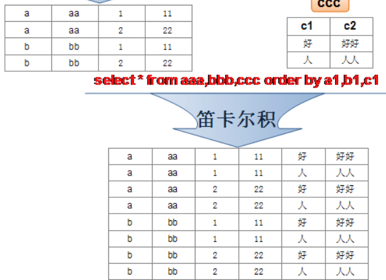

- 在多表查询中出现笛卡尔积原因：连接条件出现了问题（注意是连接条件，即是两张表的相关联字段问题）
- 为了避免笛卡尔积，应使用有效的连接条件

------

## 2.多表查询

#### 格式

- ```mysql
  #查询员工的id和部门id和部门名字
  SELECT emp.employee_id AS 'id',dept.department_name,emp.`department_id`
  FROM employees AS emp,departments AS dept
  WHERE emp.`department_id`=dept.`department_id`;#这里就是有效的连接条件
  ```

  - 可以对表名起别名（好像不能用as '别名'，只能用as 别名），这样在整个查询语句都能使用这个别名（查询语句执行的顺序，）
  - 起了表的别名后必须用别名，不能用原表名
  - 如果几张表存在相同的字段，要指明那张表的字段，建议在多表查询时都指明每个字段的表

#### 多表查询的分类：等值连接与非等值连接

- 等值连接：查询条件是使用等号的
- 非等值连接：查询条件没有等号，如范围（BETWEEN AND）

#### 多表查询的分类：自连接与非自连接

- 自连接：查询所需要的表是一张表与它本身

  ```mysql
  #举例：查询员工姓名和id，及其管理者的id和姓名
  #      利用起别名的方式来区分同一张表，用来查询不同的内容
  SELECT  e.`employee_id`,e.last_name,em.`manager_id`,em.last_name
  #e是用来查询员工的，em是来查询管理者的
  FROM employees AS e,employees AS em
  WHERE e.`manager_id`=em.`employee_id`;
  ```

- 非自连接：查询所需要的表是一张表与另外一张表

#### 多表查询的分类：内连接与外连接

------

## 3.多表查询的分类：内连接与外连接（共7种连接）

#### 1.内连接

-  概念：合并具有同一列的两个以上的表的行, 结果集中不包含一个表与另一个表不匹配的行

- 查询的结果完全符合查询条件，不符合查询条件的结果过滤掉

- 多表查询是建立在笛卡尔积的基础上的，将两张表进行笛卡尔积，在通过连接条件过滤掉不符合条件的数据

- 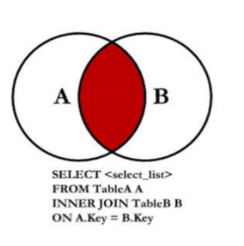

- SQL92语法实现内连接

  ```mysql
  #举例：查询员工的id和部门名称
  SELECT e.employee_id,d.department_name
  FROM employees AS e,departments AS d
  WHERE e.`department_id`=d.`department_id`;
  ```

  - 只需在WHERE中写连接条件即可

- SQL99语法实现内连接：

  - 关键字：JOIN 表名 ON 连接条件

  - 好处：SQL99 采用的这种嵌套结构非常清爽、层次性更强、可读性更强，即使再多的表进行连接也都清晰可见

  - 限制：消耗资源，超过3个表进制使用JOIN ON

  - ```mysql
    #举例：查询员工的id和部门名称
    SELECT employee_id,department_name
    FROM employees AS e 
    JOIN departments AS d ON e.`department_id`=d.`department_id`;
    ```

    ```mysql
    #举例：查询员工的姓名，部门名，和城市名
    SELECT last_name,department_name,city
    FROM employees AS e 
    JOIN departments AS d ON e.`department_id`=d.`department_id`
    JOIN locations AS s ON d.`location_id`=s.`location_id`;
    ```

  - 关键字：INNER JOIN 表名 ON 连接条件，和JOIN ON 一样，与下面的OUTER JOIN ON对应

------

#### 2.外连接：左外连接

- 外连接:两个表在连接过程中除了返回满足连接条件的行以外还返回左（或右）表中不满足条件的
  行 ，这种连接称为左（或右） 外连接。没有匹配的行时, 结果表中相应的列为空(NULL)。

- 如果是左外连接，则连接条件中左边的表也称为 主表 ，右边的表称为 从表 。
  如果是右外连接，则连接条件中右边的表也称为 主表 ，左边的表称为 从表 。

- 外连接：除了查询到符合查询条件的结果，还包含一部分不符合查询条件的结果

  - 比如：一个部门没人，或者一个员工没部门，除了查询到符合查询条件的结果集外还查询到了没有部门的人，没人的部门

- 左外连接：查询的结果包含内连接（满足查询条件的结果集），也包含左边表（主表）不符合查询条件的结果

  - 比如：左外连接查询所有员工的id和部门名称，员工表在左，部门表在右，但是存在没有部门的员工，也要查询出来

- 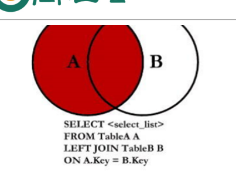

- 使用SQL99语法实现左外连接（MYSQL不支持SQL92语法实现外连接）

  - ```mysql
    #举例：查询'所有'的员工的last_name,department_name，即存在没有部门的员工，员工多
    #      注意'所有'的字眼，可能是外连接
    SELECT last_name,department_name
    FROM employees AS e 
    LEFT JOIN departments AS d ON e.`department_id`=d.`department_id`;
    ```

------

#### 3.外连接：右外连接

- 右外连接：查询的结果包含内连接（满足查询条件的结果集），也包含右边表（主表）不符合查询条件的结果

- 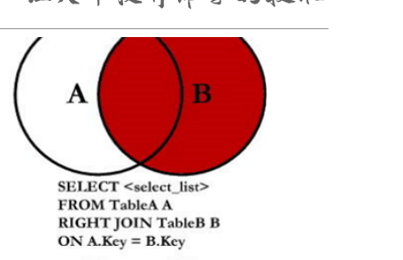

- ```mysql
  #举例：查询'所有'的员工的last_name,department_name，即存在没有人的部门，部门多
  #      注意'所有'的字眼，可能是外连接
  SELECT last_name,department_name
  FROM employees AS e 
  RIGHT OUTER JOIN departments AS d ON e.`department_id`=d.`department_id`;
  ```

------

#### 4.左外连接减去内连接

- 关键字：LEFT JOIN ON 和WHRER过滤结果

- 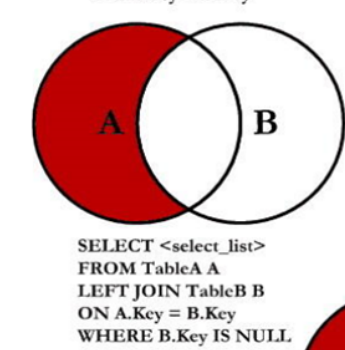

- ```mysql
  #查询没有部门的人员的id
  SELECT employee_id,department_name
  FROM employees e 
  LEFT  JOIN departments d ON e.`department_id`=d.`department_id`
  WHERE d.department_id IS NULL;
  ```

  - 为什么是 WHERE d.department_name IS NULL;

    - 当执行

      ```mysql
      SELECT *
      FROM employees e 
      LEFT  JOIN departments d ON e.`department_id`=d.`department_id`;
      ```

      由于笛卡尔积，导致查询的结果是一条记录包含了A和B的字段（用NULL填充）

      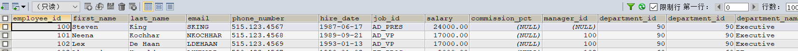

​                      在通过WHERE在过滤掉内连接数据，而内连接的数据是通过两张表的关联字段产生的（即两张表共有的数据），而只要主表的数据，就对从表的条件进行限制

------

#### 5.右外连接减去内连接

- 关键字：RIGHT JOIN ON 和WHRER过滤结果

- 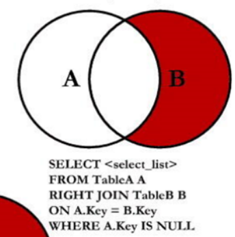

- ```mysql
  SELECT employee_id,department_name
  FROM employees e 
  RIGHT JOIN departments d ON e.`department_id`=d.`department_id`
  WHERE e.`department_id` IS NULL;
  ```

------

#### UNION的使用

- 作用：将多条查询语句的结果合并成单个结果集

- 限制条件：合并时，查询语句的列数和数据类型要相同，并且对应

- UNION的使用

  - 

  - 去除了重复的数据，即A+B-一份公共的数据，因此效率下降

- UNION ALL的使用

  - 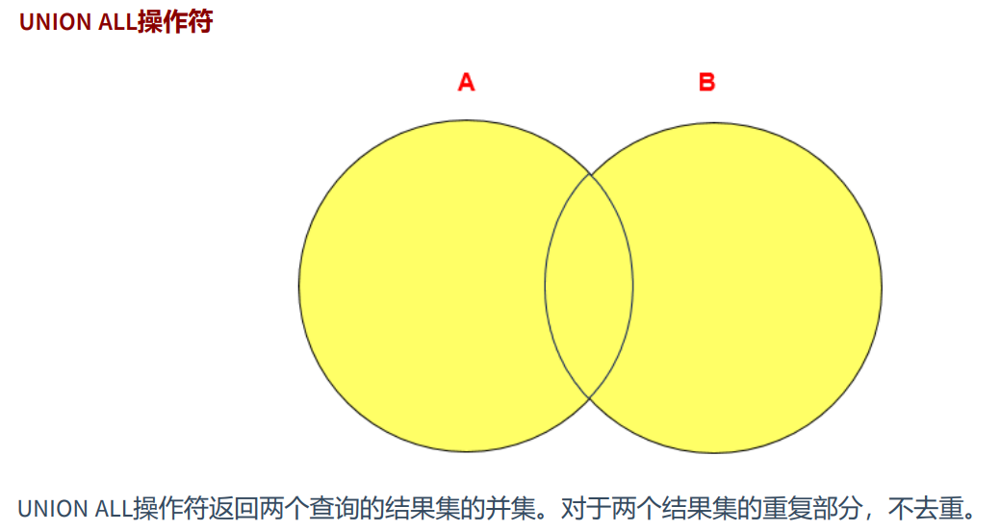
  -  没有去除重复的数据，即A+B，相当于多了一份公共的数据，效率高，因此推荐使用

------

#### 6.外连接：满外连接

- 要A和B的全部的数据

- 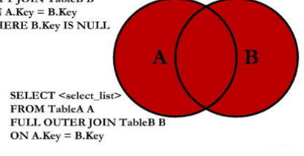

- 方式一：左外连接 加 右外连接减去内连接

  ```mysql
  SELECT employee_id,department_name
  FROM employees e 
  LEFT  JOIN departments d ON e.`department_id`=d.`department_id`
  UNION ALL
  SELECT employee_id,department_name
  FROM employees e 
  RIGHT JOIN departments d ON e.`department_id`=d.`department_id`
  WHERE e.`department_id` IS NULL;
  ```

- 方式二：右外连接 加 左外连接减去内连接

  ```mysql
  SELECT employee_id,department_name
  FROM employees e 
  RIGHT JOIN departments d ON e.`department_id`=d.`department_id`
  UNION ALL
  SELECT employee_id,department_name
  FROM employees e 
  LEFT  JOIN departments d ON e.`department_id`=d.`department_id`
  WHERE d.department_name IS NULL;
  ```

------

#### 7.满外连接减去内连接

- 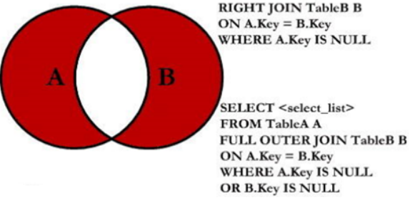

- 方式：左外连接减去内连接 加 右外连接减去内连接

  ```mysql
  SELECT employee_id,department_name
  FROM employees e 
  LEFT  JOIN departments d ON e.`department_id`=d.`department_id`
  WHERE d.department_name IS NULL
  UNION ALL
  SELECT employee_id,department_name
  FROM employees e 
  RIGHT JOIN departments d ON e.`department_id`=d.`department_id`
  WHERE e.`department_id` IS NULL;
  ```

------

## 4.新语法规则

#### USING连接

- 使用USING 指定数据表里的 同名字段 进行等值连接。但是只能配合JOIN一起使用

- 关键字：USING (表A和表B同时有的字段，且要同名)

- ```mysql
  SELECT employee_id,last_name,department_name
  FROM employees e JOIN departments d
  USING (department_id);
  ```

#### 自然连接

- 关键字：NATURAL  JOIN

- 作用：我们可以把自然连接理解为 SQL92 中的等值连接。它会帮你自动查询两张连接表中 所有相同的字段 ，然后进行 等值连接 。

- ```mysql
  在SQL92标准中：
  SELECT employee_id,last_name,department_name
  FROM employees e JOIN departments d
  ON e.`department_id` = d.`department_id`
  AND e.`manager_id` = d.`manager_id`;
  ```

- ```mysql
  SELECT employee_id,last_name,department_name
  FROM employees e NATURAL JOIN departments d;
  ```

------

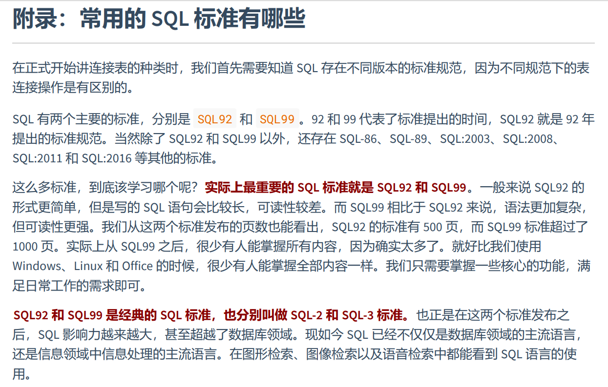