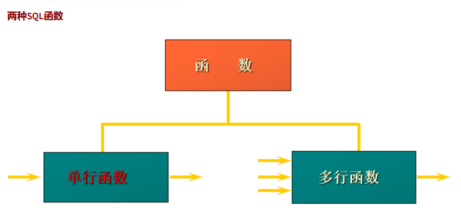
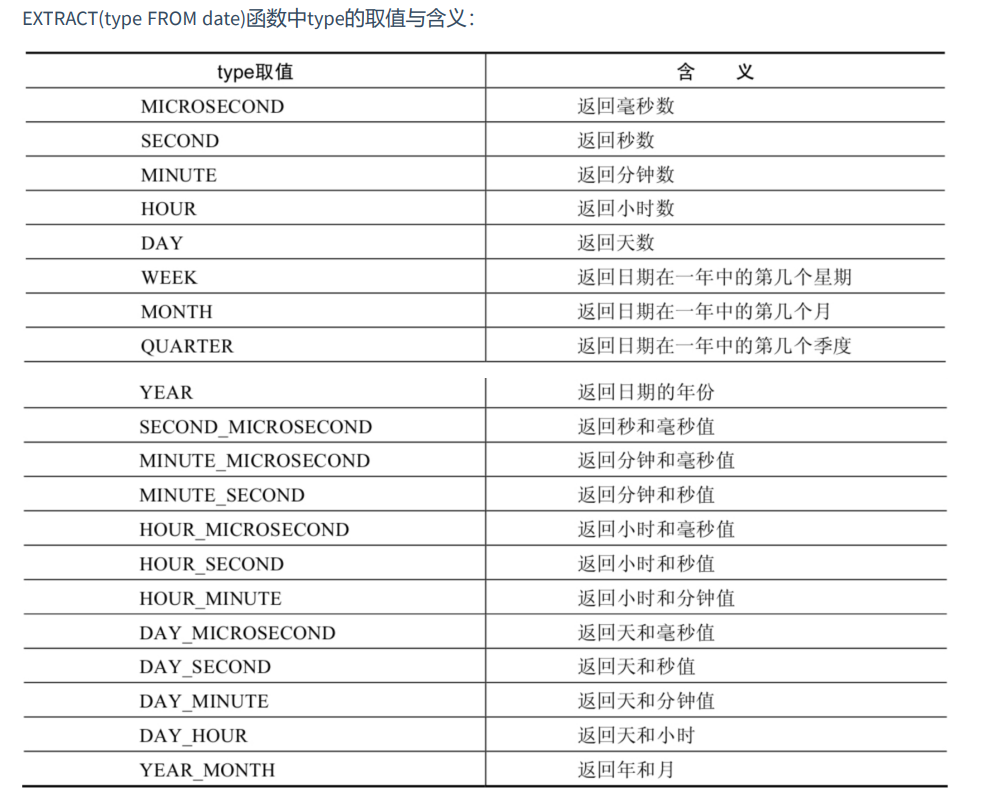
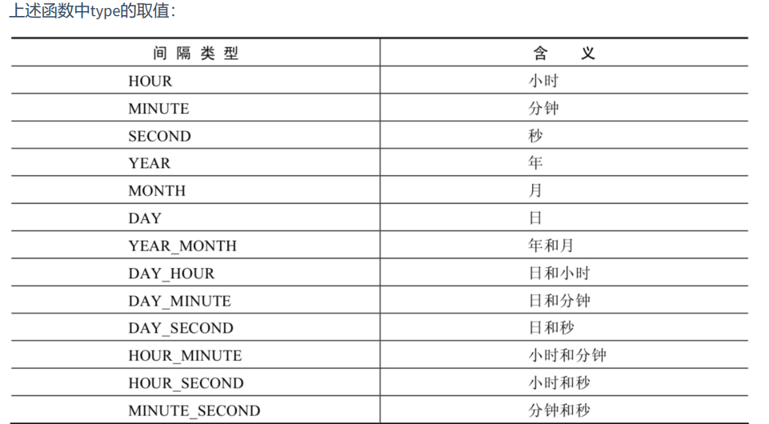
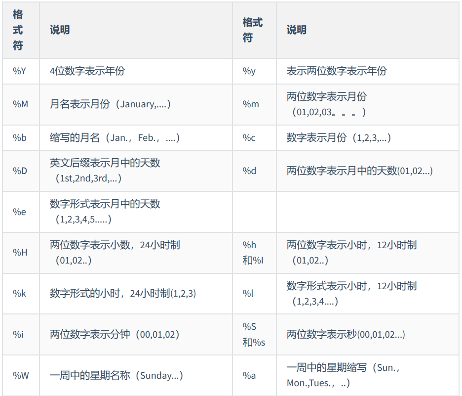
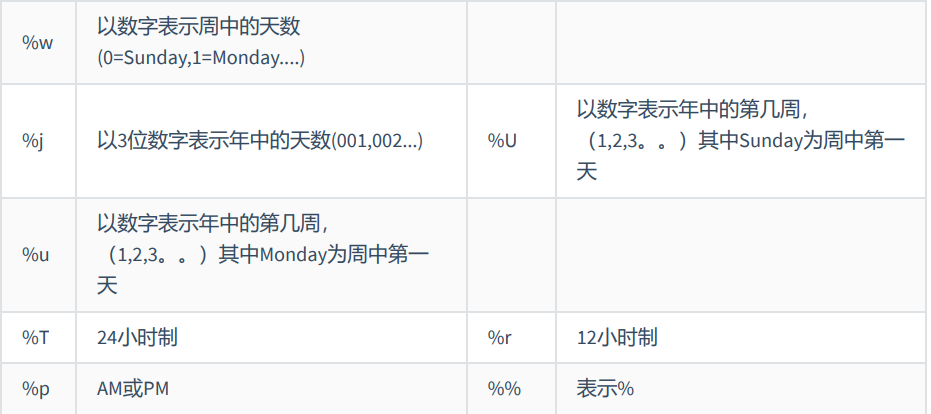
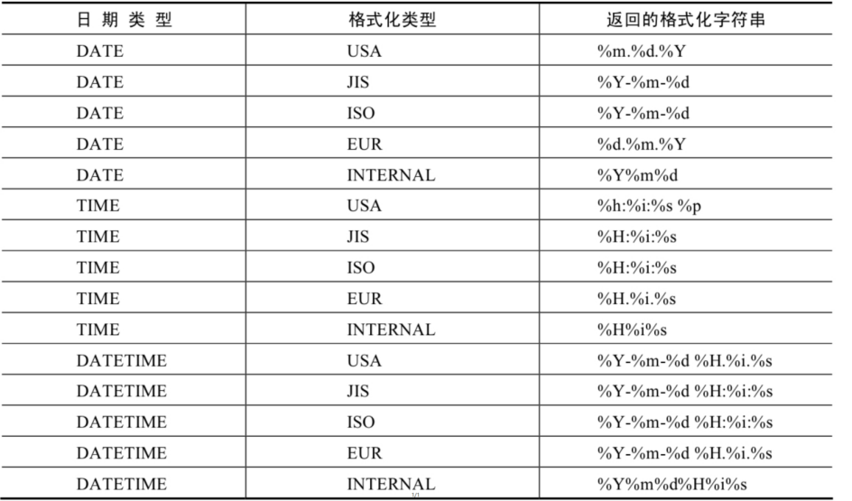

## 1.函数简介

#### 概述

- 不同的DBMS之间的函数的差异很大，因此在移植SQL语句时，注意函数的差异

#### 函数的分类

- 单行函数
  - 传入一行数据，出来一行数据
  - 可以进行单行函数的嵌套
- 聚合函数
  - 传入多行数据，出来一行数据
  - 无法进行聚合函数的嵌套
- 

------

## 2.单行函数分类：数值函数

#### 基本函数

- ABS(数1)：取绝对值

  - ```mysql
    SELECT
    ABS(-123),#123
    ABS(32)#32
    FROM DUAL;
    ```

- SIGN(数)：返回数值的符号，负数为-1，整数为+1,0为0

  - ```mysql
    SELECT
    SIGN(-23),#-1
    SIGN(23),#+1
    SIGN(0),#0
    FROM DUAL;
    ```

- PI()：返回π

  - ```mysql
    SELECT
    PI()#3.141593
    FROM DUAL;
    ```

- CELL(数1)，CELLING(数1)：天花板函数，返回大于或等于数1的最小整数

  - ```mysql
    SELECT
    CEIL(32.32),#33
    CEILING(-43.23)#-43
    FROM DUAL;
    ```

- FLOOR(数1)：地板函数，返回小于或等于某个值的最大整数

  - ```mysql
    SELECT
    FLOOR(32.32),#32
    FLOOR(-43.23)#-44
    FROM DUAL;
    ```

- MOD(数1,数2)：返回X除以Y后的余数

  - ```mysql
    SELECT
    MOD(12,5)#2
    FROM DUAL;
    ```


#### 取随机数

- RAND()：返回0~1的随机值

  - ```mysql
    SELECT
    RAND()
    FROM DUAL;
    ```

- RAND(数1)：返回0~1的随机值，其中x的值用作种子值，相同的X值会产生相同的随机

  - ```mysql
    SELECT
    RAND(10)
    FROM DUAL;
    ```

#### 舍入与截断函数

- ROUND(x,y) ：返回一个对x的值进行四舍五入后，最接近于X的整数

  - ```mysql
    SELECT
    ROUND(12.33),#12
    ROUND(12.55)#13
    FROM DUAL;
    ```

- ROUND(x,y) ：返回一个对x的值进行四舍五入后最接近X的值，并保留到小数点后面Y位

  - ```mysql
    SELECT
    ROUND(12.343,2),#12.34
    ROUND(12.324,-1)#10,参数为负数，向前一位，2不足五，舍，结果为10
    FROM DUAL;
    ```

- TRUNCATE(x,y)：返回数字x截断为y位小数的结果 

  - ```mysql
    SELECT
    TRUNCATE(12.66,1),#12.6
    TRUNCATE(12.66,-1)#10,直接截断，不进行舍入
    FROM DUAL;
    ```

- SQRT(x) ：返回x的平方根。当X的值为负数时，返回NULL

  - ```mysql
    SELECT
    SELECT SQRT(12)#SELECT SQRT(12);
    FROM DUAL;
    ```

#### 三角函数

- 角度与弧度相互转换：

- RADIANS(x) ：将角度转化为弧度，其中，参数x为角度值

  - ```mysql
    SELECT RADIANS(30)；#0.5235987755982988
    ```

- DEGREES(x) ：将弧度转化为角度，其中，参数x为弧度值

  - ```mysql
    SELECT DEGREES(2*PI())；#360
    ```

- 各种三角函数：注意各种三角函数的参数都是弧度制

  

- | 函数       | 用法                                                         |
  | ---------- | ------------------------------------------------------------ |
  | SIN(x)     | 返回x的正弦值，其中，参数x为弧度值                           |
  | ASIN(x)    | 返回x的反正弦值，即获取正弦为x的值。如果x的值不在-1到1之间，则返回NULL |
  | COS(x)     | 返回x的余弦值，其中，参数x为弧度值                           |
  | ACOS(x)    | 返回x的反余弦值，即获取余弦为x的值。如果x的值不在-1到1之间，则返回NULL |
  | TAN(x)     | 返回x的正切值，其中，参数x为弧度值                           |
  | ATAN(x)    | 返回x的反正切值，即返回正切值为x的值                         |
  | ATAN2(m,n) | 返回两个参数的反正切值                                       |
  | COT(x)     | 返回x的余切值，其中，X为弧度值                               |

#### 指数和对数


- | 函数                 | 用法                                                 |
  | -------------------- | ---------------------------------------------------- |
  | POW(x,y)，POWER(X,Y) | 返回x的y次方                                         |
  | EXP(X)               | 返回e的X次方，其中e是一个常数，2.718281828459045     |
  | LN(X)，LOG(X)        | 返回以e为底的X的对数，当X <= 0 时，返回的结果为NULL  |
  | LOG10(X)             | 返回以10为底的X的对数，当X <= 0 时，返回的结果为NULL |
  | LOG2(X)              | 返回以2为底的X的对数，当X <= 0 时，返回NULL          |

#### 进制之间的转换


- | 函数          | 用法                     |
  | ------------- | ------------------------ |
  | BIN(x)        | 返回x的二进制编码        |
  | HEX(x)        | 返回x的十六进制编码      |
  | OCT(x)        | 返回x的八进制编码        |
  | CONV(x,f1,f2) | 返回f1进制数变成f2进制数 |

------

## 3.：字符串函数

- 注意MYSQL字符串的下标是从1开始


- | 函数                             | 用法                                                         |
  | :------------------------------- | ------------------------------------------------------------ |
  | ASCII(S)                         | 返回字符串S中的第一个字符的ASCII码值                         |
  | CHAR_LENGTH(s)                   | 返回字符串s的字符数。作用与CHARACTER_LENGTH(s)相同           |
  | LENGTH(s)                        | 返回字符串s的字节数，和字符集有关                            |
  | CONCAT(s1,s2,......,sn)          | 连接s1,s2,......,sn为一个字符串                              |
  | CONCAT_WS(x,s1,s2,......,sn)     | 同CONCAT(s1,s2,...)函数，但是每个字符串之间要加上x           |
  | INSERT(str, idx, len,replacestr) | 将字符串str从第idx位置开始，len个字符长的子串替换为字符串replacestr |
  | REPLACE(str, a, b)               | 用字符串b替换字符串str中所有出现的字符串a                    |
  | UPPER(s) 或 UCASE(s)             | 将字符串s的所有字母转成大写字母                              |
  | LOWER(s) 或LCASE(s)              | 将字符串s的所有字母转成小写字母                              |
  | LEFT(str,n)                      | 返回字符串str最左边的n个字符                                 |
  | RIGHT(str,n)                     | 返回字符串str最右边的n个字符                                 |
  | LPAD(str, len, pad)              | 用字符串pad对str最左边进行填充，直到str的长度为len个字符，实现右对齐效果 |
  | RPAD(str ,len, pad)              | 用字符串pad对str最右边进行填充，直到str的长度为len个字符，实现左对齐效果 |
  | TRIM(s)                          | 去掉字符串s开始与结尾的空格                                  |
  | LTRIM(s)                         | 去掉字符串s左侧的空格                                        |
  | RTRIM(s)                         | 去掉字符串s右侧的空格                                        |
  | TRIM(s1 FROM s)                  | 去掉字符串s开始与结尾的s1                                    |
  | TRIM(LEADING s1 FROM s)          | 去掉字符串s开始处的s1                                        |
  | TRIM(TRAILING s1 FROM s)         | 去掉字符串s结尾处的s1                                        |
  | REPEAT(str, n)                   | 返回str重复n次的结果                                         |
  | SPACE(n)                         | 返回n个空格                                                  |
  | STRCMP(s1,s2)                    | 比较字符串s1,s2的ASCII码值的大小                             |
  | SUBSTR(s,index,len)              | 返回从字符串s的index位置其len个字符，作用与SUBSTRING(s,n,len)、MID(s,n,len)相同 |
  | LOCATE(substr,str)               | 返回字符串substr在字符串str中首次出现的位置，作用于POSITION(substr<br/>IN str)、INSTR(str,substr)相同。未找到，返回0 |
  | ELT(m,s1,s2,…,sn)                | 返回指定位置的字符串，如果m=1，则返回s1，如果m=2，则返回s2，如果m=n，则返回sn |
  | FIELD(s,s1,s2,…,sn)              | 返回字符串s在字符串列表中第一次出现的位置                    |
  | FIND_IN_SET(s1,s2)               | 返回字符串s1在字符串s2中出现的位置。其中，字符串s2是一个以逗号分隔的字符串 |
  | REVERSE(s)                       | 返回s反转后的字符串                                          |
  | NULLIF(value1,value2)            | 比较两个字符串，如果value1与value2相等，则返回NULL，否则返回value1 |

------

## 4.：日期和时间函数

#### 获取日期和时间


- | 函数                                                         | 用法                           |
  | ------------------------------------------------------------ | ------------------------------ |
  | CURDATE() ，CURRENT_DATE()                                   | 返回当前日期，只包含年、月、日 |
  | CURTIME() ， CURRENT_TIME()                                  | 返回当前时间，只包含时、分、秒 |
  | NOW() / SYSDATE() / CURRENT_TIMESTAMP() / LOCALTIME() /LOCALTIMESTAMP() | 返回当前系统日期和时间         |
  | UTC_DATE()                                                   | 返回UTC（世界标准时间）日期    |
  | UTC_TIME()                                                   | 返回UTC（世界标准时间）时间    |

#### 获取月份，星期，星期数，天数


- | 函数                                    | 用法                                            |
  | --------------------------------------- | ----------------------------------------------- |
  | YEAR(date) / MONTH(date) / DAY(date)    | 返回具体的日期值                                |
  | HOUR(time) / MINUTE(time) /SECOND(time) | 返回具体的时间值                                |
  | MONTHNAME(date)                         | 返回月份：January，...                          |
  | DAYNAME(date)                           | 返回星期几：MONDAY，TUESDAY.....SUNDAY          |
  | WEEKDAY(date)                           | 返回周几，注意，周1是0，周2是1，。。。周日是6   |
  | QUARTER(date)                           | 返回日期对应的季度，范围为1～4                  |
  | WEEK(date) ， WEEKOFYEAR(date)          | 返回一年中的第几周                              |
  | DAYOFYEAR(date)                         | 返回日期是一年中的第几天                        |
  | DAYOFMONTH(date)                        | 返回日期位于所在月份的第几天                    |
  | DAYOFWEEK(date)                         | 返回周几，注意：周日是1，周一是2，。。。周六是7 |

#### 日期与时间戳转换


- | 函数                     | 用法                                                         |
  | ------------------------ | ------------------------------------------------------------ |
  | UNIX_TIMESTAMP()         | 以UNIX时间戳的形式返回当前时间。SELECT UNIX_TIMESTAMP() ->1634348884 |
  | UNIX_TIMESTAMP(date)     | 将时间date以UNIX时间戳的形式返回。                           |
  | FROM_UNIXTIME(timestamp) | 将UNIX时间戳的时间转换为普通格式的时间                       |

#### 日期的操作函数

- EXTRACT(type FROM date) ：返回指定日期中特定的部分，type指定返回的值
- 

#### 时间与秒钟转换函数

- TIME_TO_SEC(time)：将 time 转化为秒并返回结果值。转化的公式为： 小时*3600+分钟
  *60+秒
- SEC_TO_TIME(seconds)：将 seconds 描述转化为包含小时、分钟和秒的时间

#### 计算日期和时间的函数

- DATE_ADD(datetime, INTERVAL expr type)，

  ADDDATE(date,INTERVAL expr type)：返回与给定日期时间相差INTERVAL时间段的日期时间

- DATE_SUB(date,INTERVAL expr type)，
  SUBDATE(date,INTERVAL expr type)：返回与date相差INTERVAL时间间隔的日期

- 


- | 函数                         | 用法                                                         |
  | ---------------------------- | ------------------------------------------------------------ |
  | ADDTIME(time1,time2)         | 返回time1加上time2的时间。当time2为一个数字时，代表的是秒 ，可以为负数 |
  | SUBTIME(time1,time2)         | 返回time1减去time2后的时间。当time2为一个数字时，代表的是 秒 ，可以为负数 |
  | DATEDIFF(date1,date2)        | 返回date1 - date2的日期间隔天数                              |
  | TIMEDIFF(time1, time2)       | 返回time1 - time2的时间间隔                                  |
  | FROM_DAYS(N)                 | 返回从0000年1月1日起，N天以后的日期                          |
  | TO_DAYS(date)                | 返回日期date距离0000年1月1日的天数                           |
  | LAST_DAY(date)               | 返回date所在月份的最后一天的日期                             |
  | MAKEDATE(year,n)             | 针对给定年份与所在年份中的天数返回一个日期                   |
  | MAKETIME(hour,minute,second) | 将给定的小时、分钟和秒组合成时间并返回                       |
  | PERIOD_ADD(time,n)           | 返回time加上n后的时间                                        |

#### 日期的格式化与解析


- | 函数                              | 用法                                       |
  | --------------------------------- | ------------------------------------------ |
  | DATE_FORMAT(date,fmt)             | 按照字符串fmt格式化日期date值              |
  | TIME_FORMAT(time,fmt)             | 按照字符串fmt格式化时间time值              |
  | GET_FORMAT(date_type,format_type) | 返回日期字符串的显示格式                   |
  | STR_TO_DATE(str, fmt)             | 按照字符串fmt对str进行解析，解析为一个日期 |

- 上述 非GET_FORMAT 函数中fmt参数常用的格式符：

- 

- 


- GET_FORMAT函数中date_type和format_type参数取值如下：
- 

------

## 5.流程控制函数


- | 函数                                                         | 用法                                            |
  | ------------------------------------------------------------ | ----------------------------------------------- |
  | IF(value,value1,value2)                                      | 如果value的值为TRUE，返回value1，否则返回value2 |
  | IFNULL(value1, value2)                                       | 如果value1不为NULL，返回value1，否则返回value2  |
  | CASE WHEN 条件1 THEN 结果1 WHEN 条件2 THEN 结果2.... [ELSE resultn] END | 相当于Java的if...else if...else...              |
  | CASE expr WHEN 常量值1 THEN 值1 WHEN 常量值1 THEN值1 .... [ELSE 值n] END | 相当于Java的switch...case..                     |

------

## 6.加密与解密函数


- | 函数                        | 用法                                                         |
  | --------------------------- | ------------------------------------------------------------ |
  | PASSWORD(str)               | 返回字符串str的加密版本，41位长的字符串。加密结果 不可逆 ，常用于用户的密码加密 |
  | MD5(str)                    | 返回字符串str的md5加密后的值，也是一种加密方式。若参数为NULL，则会返回NULL |
  | SHA(str)                    | 从原明文密码str计算并返回加密后的密码字符串，当参数为NULL时，返回NULL。 SHA加密算法比MD5更加安全 。 |
  | ENCODE(value,password_seed) | 返回使用password_seed作为加密密码加密value                   |
  | DECODE(value,password_seed) | 返回使用password_seed作为加密密码解密value                   |

  - ENCODE(value,password_seed)函数与DECODE(value,password_seed)函数互为反函数

------

## 7.MYSQL信息函数


- | 函数                                                  | 用法                                                     |
  | ----------------------------------------------------- | -------------------------------------------------------- |
  | VERSION()                                             | 返回当前MySQL的版本号                                    |
  | CONNECTION_ID()                                       | 返回当前MySQL服务器的连接数                              |
  | DATABASE()，SCHEMA()                                  | 返回MySQL命令行当前所在的数据库                          |
  | USER()，CURRENT_USER()、SYSTEM_USER()，SESSION_USER() | 返回当前连接MySQL的用户名，返回结果格式为“主机名@用户名” |
  | CHARSET(value)                                        | 返回字符串value自变量的字符集                            |
  | COLLATION(value)                                      | 返回字符串value的比较规则                                |

------

## 8.其他函数


- | 函数                           | 用法                                                         |
  | ------------------------------ | ------------------------------------------------------------ |
  | FORMAT(value,n)                | 返回对数字value进行格式化后的结果数据。n表示 四舍五入 后保留到小数点后n位 |
  | CONV(value,from,to)            | 将value的值进行不同进制之间的转换                            |
  | INET_ATON(ipvalue)             | 将以点分隔的IP地址转化为一个数字                             |
  | INET_NTOA(value)               | 将数字形式的IP地址转化为以点分隔的IP地址                     |
  | BENCHMARK(n,expr)              | 将表达式expr重复执行n次。用于测试MySQL处理expr表达式所耗费的时间 |
  | CONVERT(value USING char_code) | 将value所使用的字符编码修改为char_code                       |

------

