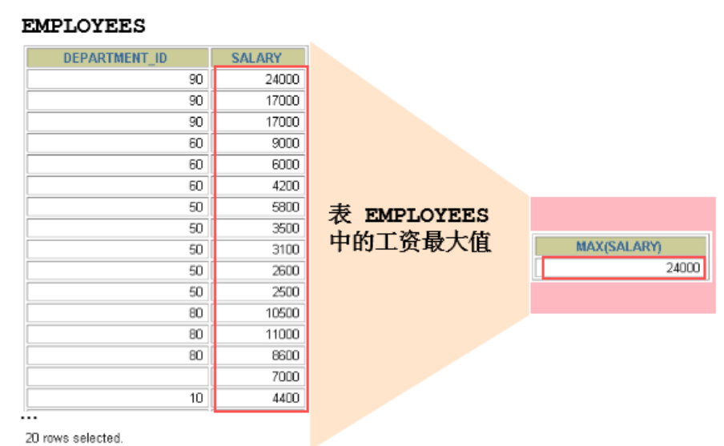

## 1.概念

- 什么是聚合函数
  - 聚合函数作用于一组数据，并对一组数据返回一个值。
- 

------

## 2.常用的聚合函数

#### 聚合函数

- 注意：聚合函数不能嵌套调用。比如不能出现类似“AVG(SUM(字段名称))”形式的调用。

- AVG()：求平均值，不考虑NULL

- SUM()：求总和，不考虑NULL

  - ```mysql
    SELECT AVG(salary),SUM(salary),SUM(employees.`commission_pct`),AVG(employees.`commission_pct`)
    FROM employees;
    ```

- MAX()：求最大值，不考虑NULL，适用于数值，字符串，日期类型

- MIN：求最小值，不考虑NULL，适用于数值，字符串，日期类型

  - ```mysql
    SELECT MAX(salary),MIN(salary),MAX(last_name),MIN(last_name)
    FROM employees;
    ```

- COUNT()：返回表中记录总数

  - ```mysql
    SELECT COUNT(last_name),COUNT(2* salary),#还是107
    COUNT(1)#还是107，1是常量，不在表中出现，相当于不是取某一字段，而是把整条数据拿1充当
    FROM employees;
    ```

#### 如何查看表中有多少条记录？

- 方式一：COUNT(1)
- 方式二：COUNT(*)
- 方式三(有条件的)：COUTN(具体字段)，这不计算为NULL的字段，只计算有具体的值的字段
- 三者的效率分析
  - 如果使用MyISAM存储引擎，则三者效率相同，都是O(1)
  - 如果使用InnoDB存储引擎，则COUNT(*)=COUNT(1)>COUNT(字段)

#### 关于AVG

- 公式：avg=sum/count  ，这些函数都不计算NULL，因此成立

- 注意：计算平均值时是否算进哪些值为NULL的记录

- 举例：计算平均奖金率

  - ```mysql
    #错误的
    SELECT AVG(e.`commission_pct`),#因为没有除以奖金率为NULL的人
    FROM employees e;
    ```

  - ```mysql
    #正确的
    SELECT SUM(e.`commission_pct`)/COUNT(IFNULL(e.`commission_pct`,0)),
    AVG(IFNULL(e.`commission_pct`,0))#这样也是正确的
    FROM employees e;
    ```

------

## 3.GROUP BY关键字

#### 举例

- 举例：求各个部门的平均工资

  ```mysql
  #需要对员工按照部门进行分组来求
  #对于部门id为NULL的员工自成一组
  SELECT e.`department_id`,AVG(salary)
  FROM employees e
  GROUP BY e.`department_id`;
  ```

- 举例：查询各个工种的平均工资

  ```mysql
  SELECT e.`job_id`,AVG(salary)
  FROM employees e
  GROUP BY e.`job_id`;
  ```

- 注意以下是不对的

  ```mysql
  #因为job_id不对
  SELECT e.`department_id`,e.`job_id`,AVG(salary)
  FROM employees e
  GROUP BY e.`department_id`;
  ```

  - 结论：分组中，在select中出现的字段（非函数中的字段，如salary），一定要出现在group by 中，反之不一定

#### 多个分组

- 进行多个分组

  - 在关键字后放两个字段即可，顺序不一样也对，无关顺序

  - 查询一个部门中，各个工种的平均工资

    ```mysql
    #需要进行两次分组，各个部门分一次组，一个部门中按照工种分一次组
    SELECT e.`department_id`,e.`job_id`,AVG(salary)
    FROM employees e
    GROUP BY e.`department_id`,e.`job_id`;
    ```

#### WITH ROLLUP关键字

- WITH ROLLUP：在计算一下整体的平均工资，并显示在最后一行

- 注意：不能与ORDER BY结合使用，会把平均值也算进内

- ```mysql
  SELECT e.`department_id`,AVG(salary)
  FROM employees e
  GROUP BY e.`department_id` WITH ROLLUP;
  ```

------

## 4.HAVING关键字

- HAVING：用于过滤数据，通常和GROUP BY联合使用

- 举例：查询各个部门中的最高工资，比10000高的 部门信息

  ```mysql
  #错误写法：
  SELECT e.`department_id`,MAX(salary)
  FROM employees e
  WHERE MAX(salary)>10000
  GROUP BY e.`department_id`;
  ```

  - 错误原因
    - 要求1：如果过滤条件使用了聚合函数，就必须使用HAVING替换WHERE，否则报错
    - 要求2：HAVING就必须放在GROUP BY后面
    - 建议：HAVING通常依赖于GROUP BY，是在一起使用的

  ```mysql
  #正确写法
  SELECT e.`department_id`,MAX(salary)
  FROM employees e
  GROUP BY e.`department_id`
  HAVING MAX(salary)>10000;
  ```

- 举例：查询部门id为(10,20,30,40)，这4个部门，最高工资比10000高的部门

  ```mysql
  #方式1：更推荐使用，执行效率高：
  SELECT e.`department_id`,MAX(salary)
  FROM employees e
  WHERE e.`department_id` IN(10,20,30,40)
  GROUP BY e.`department_id`
  HAVING MAX(salary)>10000;
  ```

  ```mysql
  #方式2：把过滤条件结合，也行
  SELECT e.`department_id`,MAX(salary)
  FROM employees e
  GROUP BY e.`department_id`
  HAVING MAX(salary)>10000 AND e.`department_id` IN(10,20,30,40);
  ```

- HAVING和WHERE对比

  - 1.HAVING使用的范围更广，因为过滤条件能用聚合函数
  - 2.WHERE执行效率高

------

## 5.SQL底层执行过程

- ```mysql
  SELECT............(存在聚合函数)
  FROM........
  (LIFT/RIGHT)JOIN.. ON....
  WHERE 多表查询的连接条件 AND 不包含聚合函数的过滤条件
  GROUP BY ...
  HAVING..包含聚合函数的过滤条件
  ORDER BY..(ASC/DESC)
  LIMIT........
  ```

- 执行的顺序分成了三部分：FROM(先找表)-->JOIN ON(有多张表先进行交叉连接，再用ON过滤)-->WHERE(继续过滤条件)-->GROUP BY(按照一定条件分组)-->
  HAVING(执行聚合函数)-->SELECT(选择显示的字段)-->ORDER BY(排序)-->LIMIT(分页显示) 

- 在分组后在使用聚合函数，聚合函数在HAVIGN中，根据语句的执行顺序，不能写在WHERE中，
  放在WHERE中，还没进行分组就使用聚合函数，不合逻辑

- WHERE先于HAVING：为了查询的效率，先WHERE过滤数据，在使用HAVING中聚合函数，此时就少了很多不需要的数据
  如果都放在HAVING中，还要对不需要的数据进行分组，浪费资源

- 字段别名是同理：与执行顺序有关