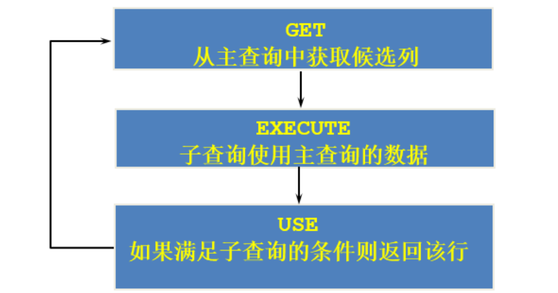

## 1.概述

#### 概念

- 子查询指一个查询语句嵌套在另一个查询语句内部的查询
  - SQL 中子查询的使用大大增强了 SELECT 查询的能力，因为很多时候查询需要从结果集中获取数据，或者需要从同一个表中先计算得出一个数据结果，然后与这个数据结果（可能是某个标量，也可能是某个集合）进行比较。
- 相当于双重for循环

#### 举例

- 谁的工资比abel的工资高

  ```mysql
  #先查询able的工资，在查询谁的工资比abel的工资高
  #使用子查询
  SELECT last_name,salary
  FROM employees
  WHERE salary >(
              SELECT salary
              FROM employees
              WHERE last_name='Abel'#注意这里没有 ;
  );
  ```

  - 称谓规范：外查询和内查询
  - 子查询（内查询）在主查询之前一次执行完成。
  - 子查询的结果被主查询（外查询）使用 。
  - 注意
    - 子查询要包含在括号内
    - 将子查询放在比较条件的右侧，方便阅读
    - 单行操作符对应单行子查询，多行操作符对应多行子查询
      - 注意这两种操作符不能混用，否则会报错误代码：1242

#### 分类

- 角度一：根据内查询的结果条目数分
  - 单行子查询：内查询查出来的数据只有一条
  - 多行子查询：内查询查出来的数据有多条
- 角度二：每一次外查询是否和内查询有关
  - （内外无关）不相关子查询：员工的工资大于本公司平均工资的人员
  - （内外有关）相关子查询：员工的工资大于部门平均工资的人员，不同部门平均工资不同

------

## 2.单行子查询（不相关子查询）

#### 单行操作符

- 单行操作符是在内查询与外查询连接处使用
- <,>,>=,<=,<>,=
- 注意：后面只能接单行子查询

#### 子查询编写思路

- 从里往外写：适合查询比较简单的情况
- 从外往里写：适合查询比较复杂的情况

#### 举例

- 查询工资大于149号员工工资的员工的信息

  ```mysql
  #注意内查询不能有 ;
  SELECT last_name,salary
  FROM employees
  WHERE salary >(
  	SELECT salary
  	FROM employees e
  	WHERE e.`employee_id`=149               
  );
  ```

- 返回job_id与141号员工相同，salary比143号员工的员工姓名，job_id和工资

  - ```mysql
    SELECT last_name,job_id,salary
    FROM employees
    WHERE job_id=(
    	SELECT job_id
    	FROM employees
    	WHERE employee_id=144
    ) AND salary> (
    	SELECT salary
    	FROM employees
    	WHERE employee_id=144
    	); 
    ```

- 返回公司工资最少的员工的last_name,job_id和salary

  ```mysql
  SELECT last_name,job_id,salary
  FROM employees
  WHERE salary=(
  	SELECT MIN(salary)
  	FROM employees
  );
  ```

- 查询与141号的manager_id和department_id相同的其他员工的employee_id，manager_id，department_id

  ```mysql
  SELECT employee_id,manager_id,department_id
  FROM employees 
  WHERE manager_id=(
  	SELECT manager_id
  	FROM employees
  	WHERE employee_id =141	
  ) AND department_id=(
  	SELECT department_id
  	FROM employees
  	WHERE employee_id =141
  ) AND employee_id != 141;
  ```

- 查询最低工资大于50号部门最低工资的部门id和其最低工资

  ```mysql
  SELECT e.`department_id`,MIN(e.`salary`)
  FROM employees e 
  GROUP BY e.`department_id`
  HAVING MIN(salary)>(
  	SELECT MIN(salary)
  	FROM employees e1
  	WHERE e1.`department_id`=50
  );
  ```

#### 子查询的空值问题

- ```mysql
  SELECT last_name, job_id
  FROM employees
  WHERE job_id =(
  	SELECT job_id
  	FROM employees
  	WHERE last_name = 'Haas'
  );
  ```

- 如果内查询没数据，或为NULL，那么外查询也没数据，并不会报错

------

## 3.多行子查询（不相关子查询）

#### 多行子查询运算符

- 多行操作符是在内查询与外查询连接处使用

- IN：等于列表中的任意一个

  - 查询各部门的最低工资，看哪些员工的工资等于最低工资

    ```mysql
    SELECT employee_id,last_name,department_id
    FROM employees
    WHERE salary IN(
    	SELECT MIN(salary)
    	FROM employees
    	GROUP BY department_id
    );
    ```

- ANY/SOME：需要和单行比较操作符一起使用，和子查询返回的某一个值比较

  - 返回其它job_id中比job_id为‘IT_PROG’部门任一工资低的员工的员工号、姓名、job_id 以及salary

    ```mysql
    SELECT employee_id,last_name,job_id,salary
    FROM employees
    WHERE salary < ANY (
    	SELECT salary
    	FROM employees
    	WHERE job_id='IT_PROG'
    ) AND job_id !='IT_PROG';
    ```

- ALL：需要和单行比较操作符一起使用，和子查询返回的所有值比较

  - 返回其它job_id中比job_id为‘IT_PROG’部门所有工资都低的员工的员工号、姓名、job_id以及salary

    ```mysql
    SELECT employee_id,last_name,job_id,salary
    FROM employees
    WHERE salary < ALL (
    	SELECT salary
    	FROM employees
    	WHERE job_id='IT_PROG'
    ) AND job_id !='IT_PROG';
    ```

#### 举例

- 查询平均工资最低的部门id

  ```mysql
  #方式一：
  #在FROM中使用子查询：
  #把子查询的结果当做是一张表（注意里面的字段要起别名），对这张表也要起别名
  #再在SELECT中使用单行函数，就能查出结果
  SELECT department_id
  FROM employees
  GROUP BY department_id
  HAVING AVG(salary)=(
  	SELECT MIN(avg_salary)
  	FROM(
  	SELECT AVG(salary) AS avg_salary
  	FROM employees
  	GROUP BY department_id
  ) AS dept_avg_salary);
  ```

  ```mysql
  #方式二：
  #<=，就相当于是找最小的了
  SELECT department_id
  FROM employees
  GROUP BY department_id
  HAVING AVG(salary) <= ALL (
  	SELECT AVG(salary) avg_sal
  	FROM employees
  	GROUP BY department_id
  );
  ```

#### 空值问题

- ```mysql
  SELECT last_name
  FROM employees
  WHERE employee_id NOT IN (
  	SELECT manager_id
  	FROM employees
  );
  ```

- 子查询出现了空值NULL，会使外查询为空，没数据，不会报错

------

## 4.相关子查询

#### 概念

- 相关子查询（关联子查询）：如果子查询的执行依赖于外部查询，通常情况下都是因为子查询中的表用到了外部的表，并进行了条件关联，因此每执行一次外部查询，子查询都要重新计算一次，这样的子查询就称之为 关联子查询 。
- 相关子查询按照一行接一行的顺序执行，主查询的每一行都执行一次子查询。
- 

#### 举例

- 查询员工中工资大于本部门平均工资的员工的last_name,salary和其department_id

  ```mysql
  #相关子查询：内查询的依赖于外查询，如本题，先在外查询中取出一条员工的记录，在送进内查询要员工的部门号，再计算出该部门的平均工资
  #重点：使用表的别名的方式，将外部的数据送进内部
  SELECT last_name,salary,department_id
  FROM employees e1
  WHERE salary>(
  	SELECT AVG(salary)
  	FROM employees e2
  	WHERE e2.department_id=e1.`department_id`
  	);
  ```

- 查询员工的id,salary,按照department_name 排序

  ```mysql
  #在ORDER BY中使用子查询
  SELECT employee_id,salary
  FROM employees e
  ORDER BY (
  	SELECT department_name
  	FROM departments d
  	WHERE e.`department_id`=d.`department_id`
  )ASC;
  ```

- 结论：在哪些位置能够使用子查询？

  - 在select,from,where,having,order by中，除了group by和limit外都能使用子查询

- 若employees表中employee_id与job_history表中employee_id相同的数目不小于2，输出这些相同id的员工的employee_id,last_name和其job_id

  ```mysql
  SELECT employee_id,last_name,job_id
  FROM employees e
  WHERE 2<=(
  	SELECT COUNT(*)
  	FROM job_history jh
  	WHERE e.employee_id=jh.`employee_id`
  );
  ```

------

## 5.EXISTS和NOT EXISTS

#### 概念

- 存在和不存在
- EXIST：一旦找到了就停止查找,找不到就继续向下找，最终都没有返回fasle
- NOT EXISTS：如果不存在某种条件，则返回TRUE，否则返回FALSE

#### 举例

- 查询公司管理者的employee_id，last_name，job_id，department_id信息查询公司管理者的employee_id，last_name，job_id，department_id信息

  ```mysql
  #只要有记录就行了，不需要记录的数量
  SELECT employee_id,last_name,job_id,department_id
  FROM employees e1
  WHERE EXISTS (
  	SELECT *
  	FROM employees e2
  	WHERE e1.`employee_id`=e2.`manager_id`
  );
  ```

- 查询departments表中，存在于employees表中的部门的department_id和department_name

  ```mysql
  #将外部的记录送进内部，找全，始终都没有找到匹配的记录就选中，就是TRUE
  #一但找到匹配的记录就FALSE
  SELECT department_id,department_name
  FROM departments d1
  WHERE NOT EXISTS(
  	SELECT *
  	FROM employees e1
  	WHERE d1.`department_id`=e1.`department_id`
  );
  ```

#### 对比自连接和子查询

- 谁的工资比Abel的高？

  ```mysql
  #方式1：自连接
  SELECT e2.last_name,e2.salary
  FROM employees e1,employees e2
  WHERE e1.last_name = 'Abel' AND e1.`salary` < e2.`salary`;
  ```

  ```mysql
  #方式2：子查询
  SELECT last_name,salary
  FROM employees
  WHERE salary > (
  	SELECT salary
  	FROM employees
  	WHERE last_name = 'Abel'
  );
  ```

- 自连接的效率更高
  - 题目中可以使用子查询，也可以使用自连接。一般情况建议你使用自连接，因为在许多 DBMS 的处理过程中，对于自连接的处理速度要比子查询快得多。

------


